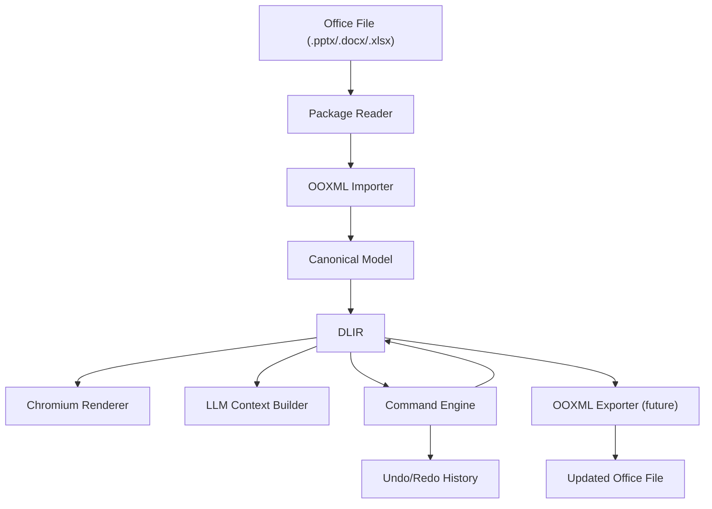

# Office Document Workspace

## 维护约定

这份文档记录 Cowork 内置 Office 文档工作区的长期实现目标、技术方案、架构边界、实现细节和当前状态。后续继续构建 Office 能力时，需要同步更新本文档，避免设计意图和实现状态丢失。

更新规则：
- 新增一种 OOXML 能力、DLIR 字段、命令类型、渲染能力或测试覆盖时，需要更新“当前状态”和对应实现章节。
- 发现架构取舍变化时，需要更新“技术路线”和“边界约束”。
- 交付阶段性能力后，需要在“里程碑”中标记完成状态。

## 背景和目标

Cowork 需要一个内置的基于 Chromium 的 Document Workspace，让用户在点击对话结果或“最近产出”中的 Office 文档时，可以直接打开、查看、编辑和通过自然语言修改文档。

目标不是简单预览文件，而是建立一个 LLM 可理解、可控制、可验证的 Office 文档编辑环境：

- 支持 PPTX、DOCX、XLSX 的高保真展示和结构化编辑。
- 能够将 Office 文件解析为比 OOXML 和 DOM 更轻、更适合 LLM 的中间层数据表达。
- 支持自然语言编辑、局部编辑、全局排版调整、内容生成和手动编辑。
- 支持撤销、重做、操作历史。
- 最终能够把中间层变更可靠导出回 Office 文件。

## 技术路线

当前选择路线 A：内置 Chromium Document Workspace，使用轻量中间层 DLIR 作为核心文档模型。

核心判断：
- 直接让 LLM 操作 OOXML 太重，token 成本高，错误率高。
- 直接让 LLM 操作 DOM 不合适，DOM 体积大，而且浏览器 DOM 不是 Office 文档的语义模型。
- 只用 Command 层不够，LLM 缺少对版面结构、行列、层级、样式和布局关系的清晰认知。
- 因此需要 DLIR：比 OOXML 简洁，但保留文档语义、版面几何、样式、对象关系和源文件映射。

长期技术方向：
- PPTX：优先实现，作为 DLIR、渲染、命令和编辑器机制的验证场。
- DOCX：后续基于段落、run、表格、图片、页边距、section 建立文档 DLIR。
- XLSX：后续基于 workbook、sheet、range、table、formula、chart 建立表格 DLIR。

## 架构概览



分层职责：

| Layer | 责任 | 当前文件 |
|---|---|---|
| Package Reader | 读取 Office zip package、XML、media | `electron/main.cjs`, `src/lib/tauri.ts` |
| OOXML Importer | 解析 PPTX OOXML 到 Canonical Model | `src/lib/document/pptx-importer.ts` |
| Theme Parser | 解析 OOXML theme、scheme color、tint/shade/alpha | `src/lib/document/ooxml-theme.ts` |
| Canonical Model | 保存面向 Office 语义的结构化模型 | `src/lib/document/presentation-model.ts` |
| DLIR | 面向 LLM 和渲染器的轻量中间层 | `src/lib/document/presentation-dlir.ts` |
| Command Engine | 修改 DLIR、生成 inverse command、支持撤销重做 | `src/lib/document/presentation-commands.ts` |
| Renderer | 在 Chromium 中渲染 slide/page/sheet | `src/components/document/presentation-slide-view.tsx` |
| Workspace UI | 文件打开、自然语言输入、历史、撤销重做 | `src/components/document/document-workspace.tsx` |

## DLIR 设计原则

DLIR 需要同时服务三个对象：
- UI 渲染器：需要坐标、尺寸、样式、层级、媒体数据。
- LLM：需要语义角色、文本摘要、阅读顺序、可编辑操作、布局关系和问题诊断。
- Command Engine：需要稳定 ID、sourceRef、可逆操作和可验证状态。

DLIR 的基本要求：
- 体积明显小于 OOXML 和 DOM。
- 保留足够版面信息：bbox、background、fill、line、shadow、transform、crop、table rows/columns。
- 保留语义信息：role、textSummary、readingOrder、importance、editableOps。
- 保留源映射：sourceRef 指向 OOXML package path 和 XML path。
- 可被 LLM 直接读取，并可作为 command 生成依据。

当前 PPTX DLIR 主要结构：
- `PresentationDLIR`
- `SlideDLIR`
- `ElementIR`
- `TextStyle`
- `ShapeStyleIR`
- `ImageStyleIR`
- `TableStyleIR`
- `LayoutRelation`
- `LayoutIssue`

## Command 机制

Command 层用于把自然语言和手动编辑转化为确定性的文档修改。

当前已实现：
- `replace_text`
- `move_element`
- `resize_element`
- `set_text_style`
- `batch`
- inverse command 生成
- undo/redo history 的基础闭环

计划补充：
- `edit_table_cell`
- `set_table_style`
- `replace_image`
- `crop_image`
- `set_fill`
- `set_line`
- `align_elements`
- `distribute_elements`
- `apply_theme`
- `rewrite_slide`
- `insert_slide`
- `delete_slide`
- `reorder_slides`

关于 JS 修改能力：
- 后续可以提供受限 JS sandbox，让 LLM 对 DLIR 执行批量变换。
- JS 只能访问受控的 DLIR helper API，不能直接访问文件系统、网络或应用状态。
- JS 执行结果必须输出 command list 或 patched DLIR，并经过 schema validation。
- 对于复杂全局排版，JS transform 会比一次性输出大量 JSON 更可靠。

## 渲染策略

当前使用 React + CSS 在 Chromium 中渲染 PPTX slide。

基本策略：
- slide 使用固定 aspect ratio。
- 元素使用 bbox 转百分比绝对定位。
- 文本元素映射字体、字号、颜色、粗细、水平/垂直对齐、边距、行距、bullet。
- shape 元素映射 fill、gradient、line、shadow、rotation、flip。
- image 元素映射 data URI、crop、opacity、rotation、flip。
- table 元素使用 CSS grid 做基础渲染，保留行列和单元格样式。
- render 区支持缩放，默认 `Fit`，也支持固定比例。
- DLIR 和文本预览通过 tab 切换，避免同时展示造成干扰。

已知限制：
- 当前还不是 PowerPoint 级别高保真渲染。
- 文本自动缩放、复杂 bullet、多 run 富文本、theme style matrix、复杂 shape geometry 仍需补齐。
- 表格边框、合并单元格边界、table style inheritance 只完成基础能力。

## OOXML 导入范围

### PPTX 已实现

- package 内 slide 列表解析。
- slide size 解析。
- slide、layout、master、theme 的基础关系解析。
- slide background 继承。
- placeholder 的 bbox、style、layout 继承。
- text shape 解析：
  - 文本内容
  - placeholder type/index
  - font size
  - font face
  - color
  - bold
  - horizontal/vertical align
  - margins
  - line spacing
  - bullet
  - autoFit
- shape 解析：
  - preset geometry
  - solid fill
  - gradient fill
  - no fill
  - line color/width/dash
  - outer shadow
  - rotation
  - flipH/flipV
- image 解析：
  - relationship media path
  - media data URI
  - crop `a:srcRect`
  - alpha opacity
  - rotation
  - flipH/flipV
- table 解析：
  - `p:graphicFrame/a:tbl`
  - column width
  - row height
  - cell text
  - cell fill
  - cell border line
  - cell text style
  - cell text layout
  - rowSpan/colSpan metadata
  - firstRow/bandRow flags
- 保留 `spTree` XML 顺序作为渲染 z-order，不按坐标重排元素。

### PPTX 待实现

- 多 run 富文本保真。
- theme font scheme。
- table style inheritance、边框、复杂合并单元格渲染。
- group shape。
- chart。
- SmartArt。
- connector/line shape。
- media video/audio。
- notes。
- animations/transitions。
- OOXML exporter。

### DOCX 待实现

目标模型：
- document
- section
- paragraph
- run
- table
- image
- header/footer
- footnote/comment

优先级：
1. 文本、标题、段落样式、列表。
2. 表格和图片。
3. 分页、页眉页脚、批注和修订。
4. 导出回 DOCX。

### XLSX 待实现

目标模型：
- workbook
- worksheet
- range
- table
- cell
- formula
- chart
- pivot metadata

优先级：
1. workbook/sheet/cell/range 读取。
2. 表格和公式结构化展示。
3. LLM 通过 range command 修改数据和公式。
4. 图表、pivot、格式和导出。

## 测试策略

当前测试集中在 PPTX 标准层：
- `src/lib/document/ooxml-theme.test.ts`
- `src/lib/document/pptx-importer.test.ts`
- `src/lib/document/presentation-dlir.test.ts`
- `src/lib/document/presentation-commands.test.ts`

已覆盖：
- theme color、tint/shade/alpha。
- layout/master placeholder inheritance。
- text layout。
- shape fill/line/shadow/transform。
- image crop/opacity/transform。
- table rows/columns/cell styles。
- table cell borders。
- slide XML element order / z-order。
- DLIR summary、reading order、layout issue。
- command undo/redo 基础行为。

后续需要补充：
- 基于真实 PPTX fixture 的 visual regression。
- slide renderer screenshot 测试。
- command schema validation 测试。
- 导出回 OOXML 后再导入的 roundtrip 测试。
- DOCX/XLSX importer 单测。

## 当前状态

截至 2026-04-25：

已完成：
- Electron/Chromium Document Workspace 基础接入。
- 点击文档可打开 Document Workspace 的基础体验。
- PPTX package 读取和媒体读取。
- PPTX importer 初版。
- Presentation canonical model。
- Presentation DLIR。
- PPTX slide 基础渲染。
- slide navigator。
- 自然语言输入区。
- 操作历史、撤销、重做基础能力。
- text、shape、image、table 的基础标准层。
- table border 基础解析和渲染。
- PPTX 元素导入保留 PowerPoint XML 顺序，避免破坏 z-order。
- render 区支持 Fit/75%/100%/125% 缩放。
- DLIR 和文本预览支持 tab 切换。
- 单测、TypeScript、Vite build 通过。

最近一次验证命令：

```bash
pnpm vitest run src/lib/document/ooxml-theme.test.ts src/lib/document/pptx-importer.test.ts src/lib/document/presentation-dlir.test.ts src/lib/document/presentation-commands.test.ts
pnpm exec tsc --noEmit
pnpm exec vite build
```

当前测试结果：
- 4 个 test files passed。
- 15 个 tests passed。
- TypeScript passed。
- Vite build passed。

构建 warning：
- Vite 仍提示主 bundle 过大。
- `src/lib/tauri.ts` 同时被静态和动态导入，影响 chunk 拆分。
- 这不是 Office 功能阻断项，但后续需要做 code splitting。

## 下一步计划

短期优先级：
1. PPTX 表格边框、合并单元格和 table style inheritance。
2. 多 run 富文本模型和渲染。
3. group shape 和 connector/line shape。
4. 基于真实 PPTX fixture 的视觉验证。
5. Command 层补齐 `edit_table_cell`、`set_fill`、`set_line`、`replace_image`、`crop_image`。
6. 设计受限 JS transform sandbox，用于 LLM 批量修改 DLIR。

中期优先级：
1. PPTX OOXML exporter。
2. DOCX importer 和 document DLIR。
3. XLSX importer 和 spreadsheet DLIR。
4. 手动编辑器：文本直接编辑、拖拽移动、resize handle、表格单元格编辑。
5. LLM 编辑执行前的 diff preview 和确认机制。

长期目标：
- 形成一套统一 Document Runtime。
- LLM 可以通过 DLIR + Command + JS transform 修改 Office 文档。
- UI 用户可以手动编辑同一个 DLIR。
- 导入、渲染、编辑、撤销、导出形成闭环。
