# Academic Paper

A clean engineering / data-presentation theme. Deep navy canvas, cyan
accents, high information density. Designed for technical reports,
post-mortems, market analyses, and quarterly reviews.

## When to use this theme

Conference talks, dissertation defenses, peer-reviewed paper presentations, grant pitches, research seminars. Anywhere substance comes first and decoration would distract. AAA contrast, serif typography, conservative dataviz palette.

## When NOT to use

Marketing pitches, startup demo days, consumer brand launches — try `vibrant-startup` or `editorial-warm`. Also avoid for engineering / data-heavy dashboards (use `technical-blue`).

## How to pick a layout

A 7-line decision tree. Scan top-to-bottom; first match wins.

1. **Long text (>500 CJK / 800 latin chars)?** → `prose` or `two-column-prose`.
2. **Image is the point?** → `visual-with-caption` (editorial) / `image-full-bleed` (cinematic) / `image-pair` (before/after).
3. **Image + supporting text?** → `visual-with-text` (visual + sibling text column; imageStyle: card or bleed). Pick `density` matching content length.
4. **Data?** → `chart-with-takeaway` (1 chart) / `data-table` (table) / `stat-grid-3` (3 KPIs) / `dashboard` (4 mixed).
5. **3-6 short points?** → `executive-summary` (with descriptions) / `visual-with-text` (textKind: bullets) / `key-point` (with icons).
6. **Side-by-side comparison?** → `compare-two-columns` / `split-2` (heterogeneous, with `ratio`).
7. **Nothing fits?** → `freeform` (last resort).

When text overflows the layout's density budget, the validator emits `DENSITY_OVERFLOW` with concrete next-step suggestions (try denser preset / switch to prose).

## Layout reference

### cover
Title slide. Pick for slide 1 only. Uses chrome `none` automatically.

- `title` — `text`, ≤ 60 chars. Required.
- `subtitle` — `text`, ≤ 80 chars. Optional.
- `eyebrow` — `text`, ≤ 20 chars. Optional. Small label above the title (e.g. "2026 Q1 Review").

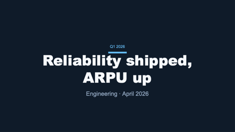

### section-divider
Section break between major parts of the deck.

- `eyebrow` — `text`, ≤ 20 chars. Optional. Small label above the title (e.g. "第二部分").
- `title` — `text`, ≤ 50 chars. Required. The section name.

### stat-grid-3
Three KPI tiles in a row. Pick when surfacing 3 headline metrics.

- `title` — `text`, ≤ 40 chars. Required.
- `items` — `bullets`, exactly 3 entries. Each entry is a KPI object:
  `{ value: text(8), label: text(20), delta: text(10), trend: up|down|flat }`.

> **Guidance:** Pick THE three most newsworthy numbers — not whatever you have data for. If only two KPIs are genuinely material, use a different layout. Don't set every `trend` to `up`; that loses signal. `value` is the headline (e.g. "$42.5M"), `label` names the metric, `delta` shows the comparison ("+85% YoY", not "85").

### quote
Pull-quote slide. Use for testimonials, key insights, or punctuation slides.

- `quote` — `text-block`, ≤ 240 chars. Required.
- `attribution` — `text`, ≤ 60 chars. Optional. Speaker / source.

### title-only
Single centered title — use as a section transition or chapter break.

- `title` — `text`, ≤ 80 chars. Required.

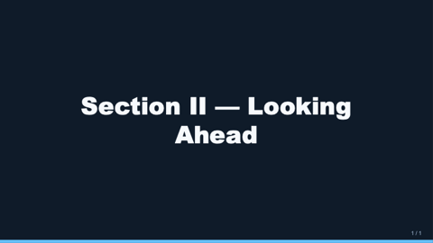

### agenda
Numbered list of upcoming sections (TOC).

- `title` — `text`, ≤ 30 chars. Optional. Defaults to "目录" / "Agenda".
- `items` — `bullets`, 2–8 entries, each ≤ 60 chars. Required.

### compare-two-columns
Side-by-side option A / option B card layout.

- `title` — `text`, ≤ 50 chars. Optional.
- `leftTitle` — `text`, ≤ 30 chars. Required.
- `leftBody` — `text-block`, ≤ 280 chars. Required.
- `rightTitle` — `text`, ≤ 30 chars. Required.
- `rightBody` — `text-block`, ≤ 280 chars. Required.

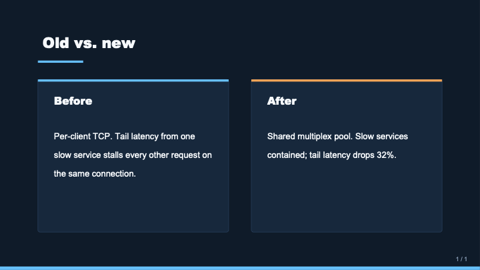

### hero-image-overlay
Full-bleed image with a translucent overlay carrying a title and subtitle.

- `image` — `image-ref`. Required.
- `title` — `text`, ≤ 60 chars. Required.
- `subtitle` — `text`, ≤ 100 chars. Optional.
- `align` — `text` (`bottom-left` | `bottom-right` | `bottom-center` | `top-left` | etc.). Optional, default `bottom-left`.

### data-table
Native OOXML table with a header row, alternating row fills, and clean borders.

- `title` — `text`, ≤ 50 chars. Optional.
- `table` — `table`. Required: `{ header: string[], rows: string[][], colWidths?: number[] }`. `colWidths` are relative weights (1–N).

### code-block
Code snippet on a dark card with monospace text and an optional language badge.

- `title` — `text`, ≤ 50 chars. Optional.
- `language` — `text`, ≤ 16 chars. Optional. Shown as a small badge top-right of the card (e.g. `typescript`, `python`).
- `code` — `text-block`, ≤ 1600 chars. Required. Newlines preserved as line breaks.
- `caption` — `markdown-inline`, ≤ 160 chars. Optional. Italic line below the card.

### closing
Mirror of `cover` — full-bleed deep-blue panel with a centered title and optional subtitle. Use as the final "thank you" slide.

- `title` — `text`, ≤ 60 chars. Required.
- `subtitle` — `text`, ≤ 80 chars. Optional.
- `image` — `image-ref`. Optional full-bleed background image; renders under a 75% brand-deep overlay.

### dashboard
2×2 grid where each cell hosts a polymorphic region. Use when one slide
must surface multiple kinds of content at once (KPI + chart + table + text).

- `title` — `text`, ≤ 50 chars. Optional.
- `tl` / `tr` / `bl` / `br` — `region` cells. Each cell is one of:
  - `{ kind: "kpi", value, label, delta?, trend? }`
  - `{ kind: "chart", chart: { type, data, format? }, title? }`
  - `{ kind: "table", table: { header, rows, colWidths? }, title? }`
  - `{ kind: "text", body, title? }`
- Only `tl` is required; remaining cells render empty when omitted.

> **Guidance:** Use this ONLY when the slide truly needs heterogeneous content together (executive briefing). For a single chart, single table, or single KPI grid prefer the focused layout (chart-with-takeaway / data-table / stat-grid-3) — they look better. Mix kinds across cells: don't put 4 KPIs here, use stat-grid-3.

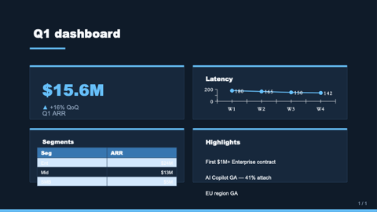

### hero-stat
One enormous headline number with a tagline. Use when the slide exists to
make ONE point land — single source of truth, like "47% of Americans...".

- `value` — `text`, ≤ 20 chars. Required. The big number ("$1.2M MRR", "47%").
- `label` — `text`, ≤ 60 chars. Required. One-sentence supporting line.
- `caption` — `text-block`, ≤ 240 chars. Optional. Smaller body context below the label.
- `eyebrow` — `text`, ≤ 32 chars. Optional. Small uppercase label above the number.

> **Guidance:** Use sparingly — at most one hero-stat per deck. The whole slide is one number, so make sure that number is the headline of the deck. Pair with a section-divider before, not a chart-with-takeaway.

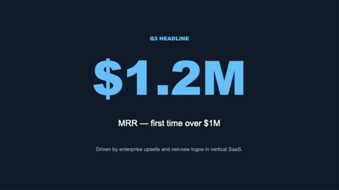

### matrix-2x2
Quadrant matrix with optional axis labels. Each quadrant is a polymorphic
region — kpi/text/bullets/image/etc. Use for BCG-style frameworks
(priority×effort, urgency×importance, growth×profitability).

- `title` — `text`, ≤ 50 chars. Optional.
- `xLabel` — `text`, ≤ 32 chars. Optional. Axis label below the matrix.
- `yLabel` — `text`, ≤ 32 chars. Optional. Axis label rotated on the left.
- `topLeft`, `topRight`, `botLeft`, `botRight` — `region` cells (all required).

> **Guidance:** Quadrants only make sense when the two axes are genuinely orthogonal. If the four boxes are just "four good ideas", use stat-grid-3 or split-3-horizontal instead. Use bullets-shaped regions for option lists; kpi for headline numbers per quadrant.

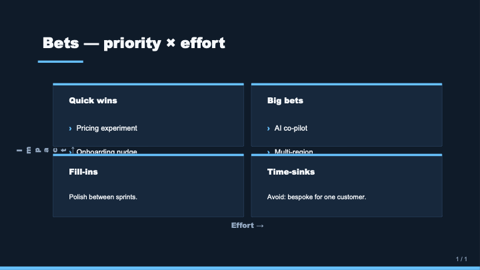

### image-full-bleed
The image fills the entire slide; an optional `caption` renders in a thin dark band along the bottom edge. Use for cinematic shots, product photography, or place-setting visuals where the picture IS the slide.

- `image` — `image-ref`. Required.
- `caption` — `text`, ≤ 120 chars. Optional. Italic credit/location line.

### visual-with-caption
Editorial layout: image at 60% width with generous left margin, italic caption below, optional uppercase credit line further down. Magazine feel.

- `image` — `image-ref`. Required.
- `caption` — `text-block`, ≤ 320 chars. Required.
- `credit` — `text`, ≤ 80 chars. Optional. Renders in small uppercase muted text.

### visual-with-text
Visual + sibling text column. Replaces the older two-col-text-image / image-split-text / bullet-with-image. Pick `textKind` (prose or bullets) and `imageStyle` (card or bleed, image only).

- `title` — `text`, ≤ 60 chars. Optional.
- `visual` — `visual` ({ kind: "image" | "chart" | "table" | "svg", ... }). Optional (no visual → text fills slide).
- `textKind` — enum `prose` | `bullets`. Default `prose`.
- `text` — `text-block`, ≤ 1500 chars. Required when textKind=prose.
- `bullets` — `bullets`, 2-7 items × 140 chars. Required when textKind=bullets.
- `position` — enum `left` | `right`. Visual side. Default `right`.
- `imageStyle` — enum `card` | `bleed`. Image-only; chart/table/svg ignore it. Default `card`.
- `ratio` — text:visual width. Default `50-50`.
- `density` — `loose | normal | dense | micro`. Prose body density.

### pricing-table
2–4 pricing tier cards in a row. Each tier: `{ name, price, period?, features?, recommended? }`. Recommended tier renders with a brand fill + ribbon.

- `title` — `text`, ≤ 50 chars. Optional.
- `tiers` — `bullets`, 2–4 entries. Each entry is the tier object above.

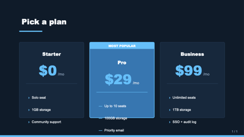

### key-point
One central tagline + 2–4 supporting points underneath, each with optional icon (from the 12-icon enum) + heading + 1-line description. Use for "3 reasons why", "core principles", learn-objectives slides.

- `headline` — `text`, ≤ 80 chars. Required.
- `points` — `bullets`, 2–4 entries. Each entry is `{ icon?, title, description? }`.

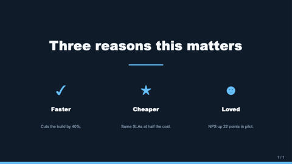

### freeform
Escape-hatch layout — pass a `shapes` array of typed primitives with positions in fractions of slide size. Use ONLY when no other layout fits (custom diagrams, bespoke compositions).

- `title` — `text`, ≤ 80 chars. Optional.
- `shapes` — `bullets`, 1–40 entries. Each entry is `{ kind, x, y, w, h, ... }` where `kind` is `text | rect | roundRect | ellipse | line | image`. Coordinates are 0..1 fractions; origin top-left.

> **Guidance:** This is a power tool — most decks should never reach for it. Try a region-based layout (split-N, dashboard, framed, matrix-2x2) first.

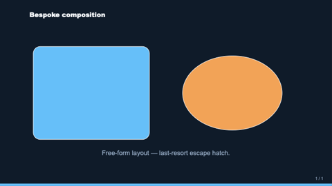

### prose
Single-column long-form text. Title + optional subtitle + multi-paragraph
body. Body accepts typed paragraphs `{ kind: "quote"|"note"|"callout"|"h2", text }`
mixed with plain strings. Use for memo-style slides, white-paper internal
pages, board minutes, essays.

- `title` — `text`, ≤ 80 chars. Optional.
- `subtitle` — `text`, ≤ 120 chars. Optional.
- `body` — `text-block`, ≤ 1600 chars. Required.

> **Guidance:** Keep paragraphs ≤ 4 lines each. If you have > 800 chars and want denser layout, switch to `two-column-prose`.

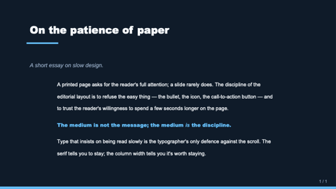

### executive-summary
TL;DR clipboard for report front-pages. Title + 3–6 numbered entries,
each `{ heading, line }`. Quieter than `key-point` (no icons, left-aligned).

- `title` — `text`, ≤ 60 chars. Optional.
- `items` — `bullets`, 2–6 entries. Each `{ heading, line? }`.

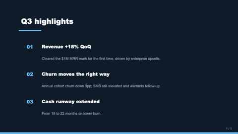

### q-and-a
FAQ / Q&A list. Each pair: bold question + indented answer.

- `title` — `text`, ≤ 60 chars. Optional.
- `items` — `bullets`, 1–5 entries. Each `{ q | question, a | answer? }`.

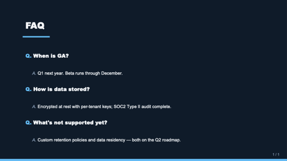

### definition
Single-term dictionary page. Big term + optional pronunciation +
part-of-speech + definition body + optional example block.

- `term` — `text`, ≤ 40 chars. Required.
- `pronounce` — `text`, ≤ 60 chars. Optional.
- `partOfSpeech` — `text`, ≤ 32 chars. Optional.
- `body` — `text-block`, ≤ 600 chars. Required.
- `example` — `text-block`, ≤ 240 chars. Optional. Italic, brand-bordered.

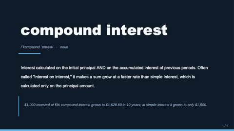

### outline
Multi-level table of contents with numbered top-level entries + indented
sub-items. Like `agenda` but supports nesting via `{ text, sub: [...] }`.

- `title` — `text`, ≤ 60 chars. Optional.
- `items` — `bullets`, 2–8 entries. Each `string` or `{ text, sub: [string] }`.

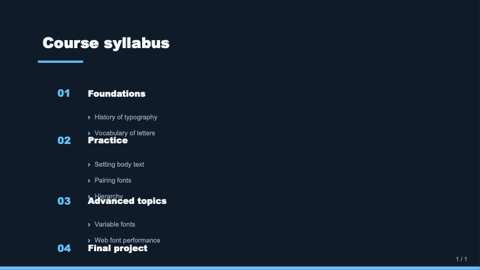

### letter
Letter / open-letter format. Date + recipient + multi-paragraph body +
sign-off + signature + optional role. Use for CEO letters to shareholders,
public letters to users, commemorative slides.

- `date` — `text`, ≤ 40 chars. Optional.
- `recipient` — `text`, ≤ 60 chars. Optional.
- `body` — `text-block`, ≤ 1400 chars. Required.
- `signoff` — `text`, ≤ 40 chars. Optional. Default "Sincerely," / "此致".
- `signature` — `text`, ≤ 60 chars. Required.
- `signRole` — `text`, ≤ 80 chars. Optional.

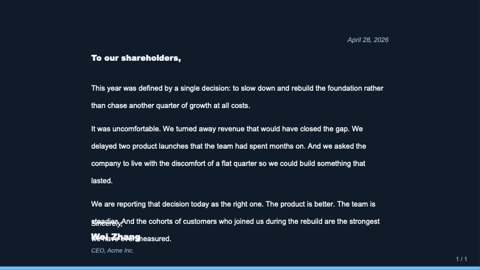

### glossary
Two-column term + definition list. Like a printed glossary or a spec's
"definitions" page. Different from `definition` which is one-term-per-slide.

- `title` — `text`, ≤ 60 chars. Optional.
- `terms` — `bullets`, 3–12 entries. Each `{ term | word, definition | meaning }`.

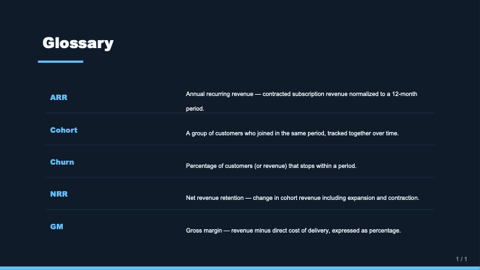

### framed
Five-region layout with optional edge bands — header, footer, leftEdge,
rightEdge, plus a required center. Use when one slide needs more
context than the global chrome can carry: persistent legends, side
glossaries, full-width headlines tied to a chart below.

- `title` — `text`, ≤ 50 chars. Optional. Small slide title above the header band.
- `header` — `region`. Optional. Top band, full slide width.
- `footer` — `region`. Optional. Bottom band, full slide width.
- `leftEdge` / `rightEdge` — `region`. Optional. Sidebar columns.
- `center` — `region`. Required. Main content area; expands to fill any unused edge space.

> **Guidance:** If you only need a header or only a footer, prefer the standard chrome (`page-header`, `page-footer`) and a focused layout. Reach for `framed` when two or more edges genuinely carry content. Avoid pairing it with thick global chrome — set `chrome: none` to give the edges room.

### team-grid
Photo grid of team members — circular avatars + name + role + optional bio.
2–8 members; 5+ members render as two rows.

- `title` — `text`, ≤ 50 chars. Optional.
- `members` — `bullets`, 2–8 entries. Each entry is `{ name, role?, image?, bio? }` where `image` is an `image-ref` (rendered with `shape: "circle"` automatically).

> **Guidance:** Bios are 1-line max. Don't over-pack — if you have 6 members and 3 sentences each, the slide collapses. Use `image_gen` only when you have actual headshot URLs; otherwise omit `image` and the layout draws a polite placeholder circle.

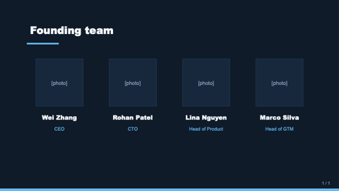
### timeline
Step or event sequence with a connecting rail and dots. Replaces the older timeline (horizontal step diagram) and timeline-text (vertical narrative timeline).

- `title` — `text`, ≤ 60 chars. Optional.
- `items` — `bullets`, 2-6 entries. Each `{ when?, title, description? }` (or a bare string treated as title). `when` renders in a left date column when direction=vertical.
- `direction` — enum `horizontal` (default — process diagram) | `vertical` (narrative timeline with optional date column).

### split
N polymorphic regions arranged in a row, column, or T-shape. Replaces split-2, split-3-horizontal, and split-3-vertical.

- `title` — `text`, ≤ 50 chars. Optional.
- `cell1`, `cell2` — `region`. Required.
- `cell3` — `region`. Optional (used when cells=3).
- `cells` — enum `2` | `3`. Default `2`.
- `direction` — enum `horizontal` (default) | `vertical` (only meaningful for cells=3 — produces T-shape: top row + 2-cell bottom).
- `ratio` — width/height ratio between cells. See enum values for direction-specific options.

### image-grid
Gallery of 2–4 images. Replaces image-pair and image-grid.

- `title` — `text`, ≤ 50 chars. Optional.
- `images` — `bullets`, 2-4 entries. Each `{ src, alt?, caption? }` or bare path string.
- count=2 (auto when 2 images supplied) renders side-by-side with optional uppercase label band above each image.
- count=4 renders 2×2 grid with each tile in a card and optional caption below.

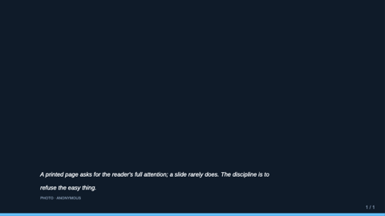

### funnel
Conversion / sales funnel — 3–6 stages narrowing top-down.

- `title` — `text`, ≤ 42 chars. Optional.
- `stages` — `bullets`, 3–6. Each `{ label, value?, sublabel? }`. Width tapers uniformly; value/sublabel render in right column.

### process-flow
Causal A→B→C pipeline rendered as connected chevrons. Use over `timeline` when conveying STAGES (no dates), over `key-point` when order matters.

- `title` — `text`, ≤ 42 chars. Optional.
- `steps` — `bullets`, 2–8. Each `{ title, description? }`.
- `direction` — `enum`: `horizontal` (default) | `vertical`. Optional.

### swot
Fixed Strengths / Weaknesses / Opportunities / Threats quadrants with canonical color semantics. Distinct from `matrix-2x2` (which is generic axis-labelled quadrants).

- `title` — `text`, ≤ 42 chars. Optional. Defaults to "SWOT 分析" / "SWOT Analysis".
- `strengths`, `weaknesses`, `opportunities`, `threats` — `bullets`, 1–6 each.

### content-grid
3–8 `{title, body}` cards in an auto-flex grid. Use over `key-point` (max 4) or `dashboard` (overkill for plain text) for the "I have N small content blocks" pattern.

- `title` — `text`, ≤ 42 chars. Optional.
- `items` — `bullets`, 3–8. Each `{ title, body? }`. Layout shape: 3→1×3, 4→2×2, 5–6→2×3, 7–8→2×4.

### roadmap
Gantt-style time × tracks. Periods axis (3–12 quarters/months) × tracks (1–7 work-stream lanes), each carrying phase bars that span one or more periods.

- `title` — `text`, ≤ 42 chars. Optional.
- `periods` — `bullets`, 3–12. Time bucket labels (`["Q1 2026", "Q2 2026", ...]`).
- `tracks` — `bullets`, 1–7. Each `{ name, bars: [{ start, end?, label?, status? }] }`. `start`/`end` are 0-based period indices. `status`: `planned|in-progress|done|at-risk|blocked` drives semantic color; otherwise track inherits a categorical color.

## Components

### header
Slide-top eyebrow + title block. Used internally by content layouts.

- `eyebrow` — `text`, ≤ 20 chars. Optional.
- `title` — `text`, ≤ 60 chars. Required.

### footer
Slide-bottom byline (date or context). Not used by chrome — see `page-number` for the master page-number stamp.

- `text` — `text`, ≤ 40 chars. Required.

### kpi-tile
A single KPI card. Slots: `value` (text ≤ 8), `label` (text ≤ 20),
`delta` (text ≤ 10, optional), `trend` (text `up`/`down`/`flat`, optional).

### takeaway-callout
Boxed conclusion at the bottom of a content slide.

- `text` — `markdown-inline`, ≤ 160 chars. Required.

## Tokens

This theme exposes these tokens. SlideML can reference them via theme defaults.

- `bg-canvas` — deep navy slide background.
- `bg-card` — slightly lighter card / surface fill.
- `brand-primary` — cyan, primary accents and KPI values.
- `brand-deep` — deeper blue, secondary accents and section dividers.
- `text-strong` — high-contrast body and title text.
- `text-muted` — labels, captions, page numbers.
- `accent` — warm orange, used sparingly for deltas / callouts.
- `divider` — hairline color for separators and outlines.
- `font-latin` — Latin: Inter → IBM Plex Sans → Helvetica Neue → Arial. Inter is the engineering-blog default; IBM Plex is the next-best fallback when Inter is unavailable.
- `font-cjk` — CJK: PingFang SC (macOS) → Source Han Sans CN (Linux) → Microsoft YaHei (Windows) → Noto Sans CJK SC (cross-platform). Order targets macOS first because the deck author is most likely viewing on macOS; Windows-installed Office picks YaHei.
- `font-mono` — JetBrains Mono → Fira Code → SF Mono → Menlo → Consolas. Code blocks expect a programming font with proper ligatures and 0/O distinction.

## Chrome

Decorations applied to every slide unless the slide opts out with `chrome: none`.

- `page-number` — bottom-right, muted; "n / N" format.
- `brand-bar` — 2pt cyan bar along the bottom edge.

## Examples

See `examples/` for short SlideML decks rendered in this theme.
