# Charcoal Minimal

Minimal, print-friendly theme — off-white canvas, near-black text, charcoal accents, single warm pop. No accent rules. Maximum restraint.

## When to use this theme
- Print-friendly hand-outs, minimalist consulting briefs, B&W-safe decks.

## When NOT to use
- Decks where you want a strong brand identity (this is intentionally muted).

## Layout reference

### cover
Title slide. Pick for slide 1 only. Uses chrome `none` automatically.

- `title` — `text`, ≤ 60 chars. Required.
- `subtitle` — `text`, ≤ 80 chars. Optional.
- `eyebrow` — `text`, ≤ 32 chars. Optional. Small label above the title.

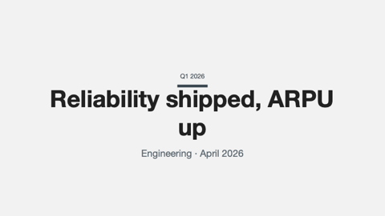

### agenda
Numbered list of upcoming sections (TOC).

- `title` — `text`, ≤ 30 chars. Optional.
- `items` — `bullets`, 2–8 items, ≤ 60 chars each.

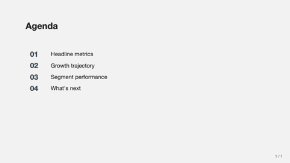

### stat-grid-3
Three KPI tiles in a row. Pick when surfacing 3 headline metrics.

- `title` — `text`, ≤ 40 chars.
- `items` — `bullets`, exactly 3, each `{ value, label, delta?, trend? }`.

> **Guidance:** Pick THE three most newsworthy numbers. Don't set every `trend` to `up`.

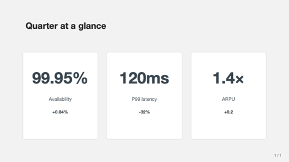

### chart-with-takeaway
Title + native data chart + boxed conclusion.

- `title` — `text`, ≤ 50 chars.
- `chart` — `chart-spec`.
- `takeaway` — `markdown-inline`, ≤ 160 chars. Optional.

> **Guidance:** The takeaway is a CONCLUSION (so-what), not a chart caption.

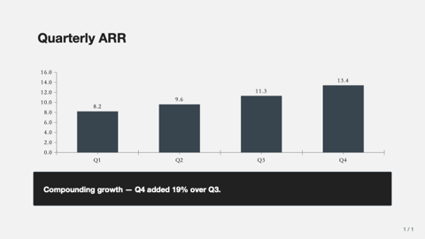

### bullet-with-image
Title + 3–6 bullets on the left, image on the right (optional).

- `title` — `text`, ≤ 50 chars.
- `bullets` — `bullets`, 3–6 items, ≤ 80 chars each.
- `image` — `image-ref`. Optional.

> **Guidance:** Bullets are TERSE — typically 5-12 words. Long prose belongs in `notes:`.

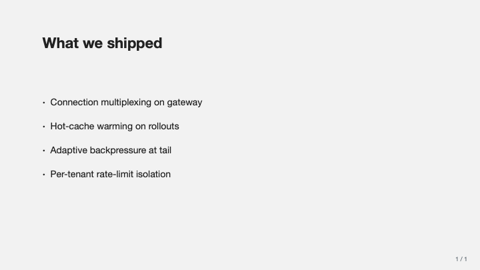

### closing
Mirror of `cover` — full-bleed deep panel. Use as the final "thank you" slide.

- `title` — `text`, ≤ 60 chars.
- `subtitle` — `text`, ≤ 80 chars. Optional.

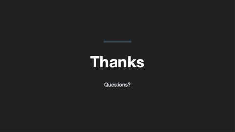

### split-2
Title (optional) over two side-by-side cells; each cell is a polymorphic `region` (one of 8 kinds: kpi/chart/table/text/bullets/image/code/quote). Use for heterogeneous side-by-side content (bullets vs. chart, image vs. quote, code vs. explanation).

- `title` — `text`, ≤ 50 chars. Optional.
- `left`, `right` — `region` cells (required).

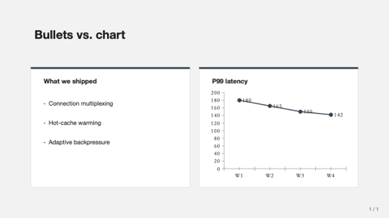

### split-3-horizontal
Title (optional) over three equal-width regions. Use for parallel comparison.

- `title` — `text`, ≤ 50 chars. Optional.
- `left`, `center`, `right` — `region` cells (required).

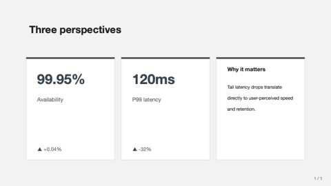

### split-3-vertical
Title (optional); full-width top region over a 50/50 bottom row. Use for "headline + supporting evidence".

- `title` — `text`, ≤ 50 chars. Optional.
- `top` — `region` (required, full width).
- `bl`, `br` — `region` cells (optional, bottom 50/50).

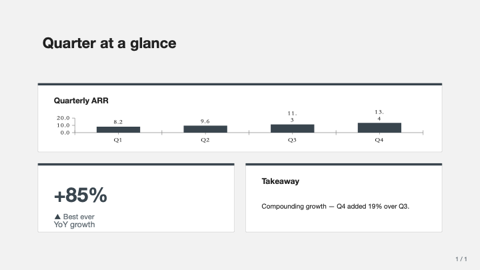

### hero-stat
One enormous headline number with a tagline. Use when the slide exists to make ONE point land.

- `value` — `text`, ≤ 20 chars. Required.
- `label` — `text`, ≤ 60 chars. Required.
- `caption` — `text-block`, ≤ 240 chars. Optional.
- `eyebrow` — `text`, ≤ 32 chars. Optional. Small uppercase label above the number.

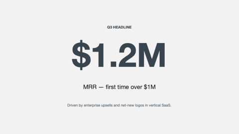

### matrix-2x2
Quadrant matrix with optional axis labels — each quadrant is a `region` cell.

- `title` — `text`, ≤ 50 chars. Optional.
- `xLabel`, `yLabel` — `text`, ≤ 32 chars. Optional axis labels.
- `topLeft`, `topRight`, `botLeft`, `botRight` — `region` cells (all required).

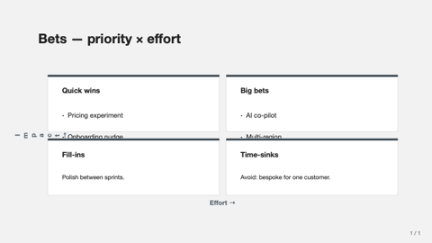

### team-grid
Photo grid of 2–8 team members; circular avatars + name + role + optional bio.

- `title` — `text`, ≤ 50 chars. Optional.
- `members` — `bullets`, 2–8 entries. Each `{ name, role?, image?, bio? }`.

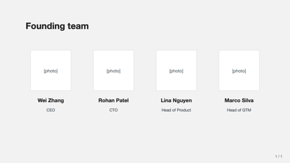

### image-full-bleed
Image fills the entire slide; optional `caption` in a thin dark band.

- `image` — `image-ref`. Required.
- `caption` — `text`, ≤ 120 chars. Optional.

### image-with-caption
Image with editorial italic caption + optional credit line.

- `image` — `image-ref`. Required.
- `caption` — `text-block`, ≤ 320 chars. Required.
- `credit` — `text`, ≤ 80 chars. Optional.

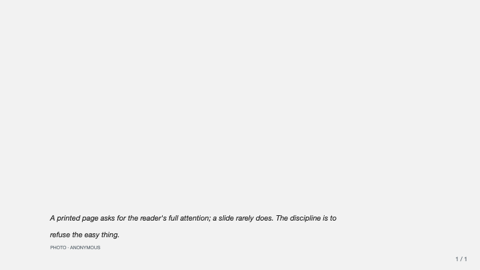

### image-pair
Two side-by-side images for before/after comparison.

- `title` — `text`, ≤ 50 chars. Optional.
- `leftImage`, `rightImage` — `image-ref`. Required.
- `leftLabel`, `rightLabel` — `text`, ≤ 32 chars. Optional.

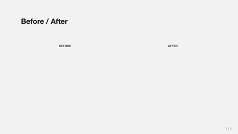

### image-split-text
Immersive 50/50 — image edge-to-edge on its half, text on the other.

- `title` — `text`, ≤ 60 chars. Required.
- `text` — `text-block`, ≤ 480 chars. Required.
- `image` — `image-ref`. Required.
- `imageSide` — `text` (left|right). Optional.

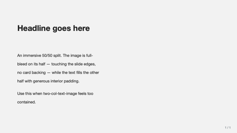

### pricing-table
2–4 pricing tier cards. Tiers: `{ name, price, period?, features?, recommended? }`.

- `title` — `text`, ≤ 50 chars. Optional.
- `tiers` — `bullets`, 2–4 entries.

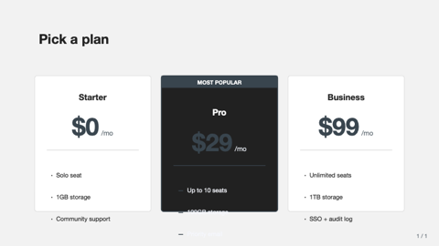

### quote-with-portrait
Pull-quote with circular portrait + name + role.

- `quote` — `text-block`, ≤ 280 chars. Required.
- `name` — `text`, ≤ 60 chars. Required.
- `role` — `text`, ≤ 80 chars. Optional.
- `portrait` — `image-ref`. Optional.

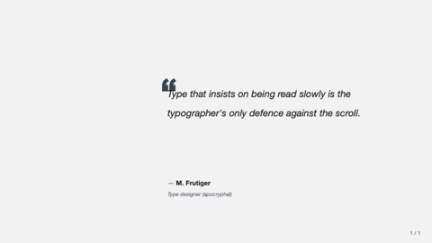

### key-point
Headline + 2–4 supporting points (icon + heading + 1-line description).

- `headline` — `text`, ≤ 80 chars. Required.
- `points` — `bullets`, 2–4 entries. Each `{ icon?, title, description? }`.

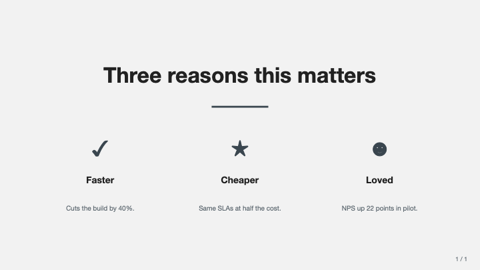

### freeform
Escape-hatch — pass `shapes: [{ kind, x, y, w, h, ... }]` directly.

- `title` — `text`, ≤ 80 chars. Optional.
- `shapes` — `bullets`, 1–40 entries.

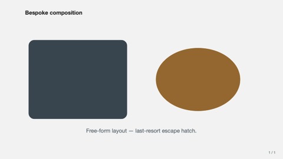

### framed
Optional header/footer/left-edge/right-edge bands plus a required center region.

- `title` — `text`, ≤ 50 chars. Optional.
- `header`, `footer`, `leftEdge`, `rightEdge` — `region`. Optional bands.
- `center` — `region`. Required.

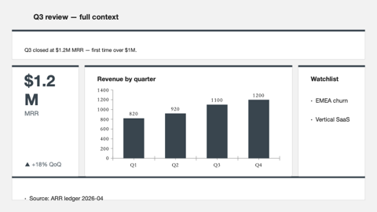

## Tokens

| Token | Value |
|---|---|
| `bg-canvas` | #F2F2F2 off-white |
| `bg-card` | #FFFFFF white |
| `text-strong` | #212121 near-black |
| `text-muted` | #5A6770 cool gray |
| `brand-primary` | #36454F charcoal |
| `brand-deep` | #212121 black |
| `accent` | #D49B5C warm amber pop |
| `font-latin` | Helvetica Neue → Helvetica → Inter → Arial | Swiss design lineage — Helvetica first, Inter as the modern open-source fallback |
| `font-cjk`   | PingFang SC → Source Han Sans CN → MS YaHei → Noto Sans CJK SC | macOS-first CJK; Source Han is the tightest fallback for Linux/Windows when PingFang is missing |
| `font-mono`  | JetBrains Mono → SF Mono → Menlo → Consolas | Used by code-block; JetBrains for ligatures, SF Mono for macOS-native rendering |
