# Editorial Paper

A magazine-style theme. Refined paper palette (cream canvas, oxblood
accent, brushed-gold detail), serif headlines, asymmetric margins,
hairline rules. Designed to make a slide read like a printed page —
considered, literary, paced.

## When to use this theme
- Founder letters, year-end essays, "state of the company" pieces.
- Long-form reports that will be printed.
- Design / culture / editorial content where the reading experience matters.
- Annual-report or museum-catalogue style slides.

## When NOT to use
- Engineering reviews (use `technical-blue`).
- Sales pitches and quarterly KPIs (use `midnight-executive`).
- Any deck with a hard data-density requirement — the serifs and generous
  margins burn space.
- Big-room keynotes — the tone is intimate, not amphitheater-scale.

## How to pick a layout

A 7-line decision tree. Scan top-to-bottom; first match wins.

1. **Long text (>500 CJK / 800 latin chars)?** → `prose` or `two-column-prose`.
2. **Image is the point?** → `visual-with-caption` (editorial) / `image-full-bleed` (cinematic) / `image-pair` (before/after).
3. **Image + supporting text?** → `visual-with-text` (visual + sibling text column; imageStyle: card or bleed). Pick `density` matching content length.
4. **Data?** → `chart-with-takeaway` (1 chart) / `data-table` (table) / `stat-grid-3` (3 KPIs) / `dashboard` (4 mixed).
5. **3-6 short points?** → `executive-summary` (with descriptions) / `visual-with-text` (textKind: bullets) / `key-point` (with icons).
6. **Side-by-side comparison?** → `compare-two-columns` / `split-2` (heterogeneous, with `ratio`).
7. **Nothing fits?** → `freeform` (last resort).

When text overflows the layout's density budget, the validator emits `DENSITY_OVERFLOW` with concrete next-step suggestions (try denser preset / switch to prose).

## Layout reference

### cover
Title with eyebrow + subtitle. Use for slide 1.

- `title` — `text`, ≤ 60 chars. Required.
- `subtitle` — `text`, ≤ 80 chars. Optional.
- `eyebrow` — `text`, ≤ 32 chars. Optional. Renders in small uppercase.

### title-only
Centered title. Use as a chapter break or section pause.

- `title` — `text`, ≤ 80 chars. Required.

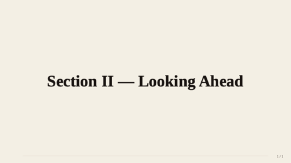

### agenda
Numbered list of essay sections.

- `title` — `text`, ≤ 30 chars. Optional.
- `items` — `bullets`, 2–8 entries.

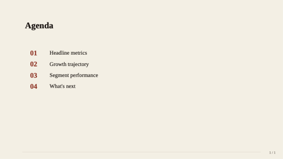

### section-divider
Section break.

- `eyebrow` — `text`, ≤ 32 chars. Optional.
- `title` — `text`, ≤ 50 chars. Required.

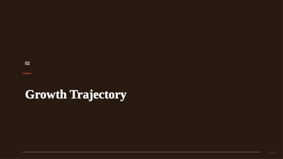

### stat-grid-3
Three KPI tiles. In this theme renders with the cream card backing.

- `title` — `text`, ≤ 40 chars. Required.
- `items` — `bullets`, exactly 3 entries.

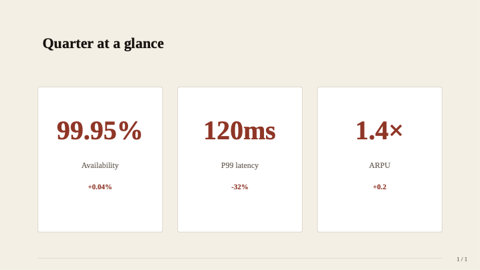

### hero-stat
One enormous headline number — perfect for the deck's load-bearing fact.

- `value` — `text`, ≤ 20 chars. Required.
- `label` — `text`, ≤ 60 chars. Required.
- `caption` — `text-block`, ≤ 240 chars. Optional.
- `eyebrow` — `text`, ≤ 32 chars. Optional.

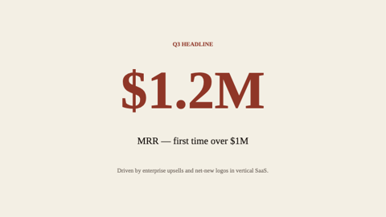

### matrix-2x2
Editorial 2×2 framework.

- `title`, `xLabel`, `yLabel` — `text`. Optional.
- `topLeft`, `topRight`, `botLeft`, `botRight` — `region` cells.

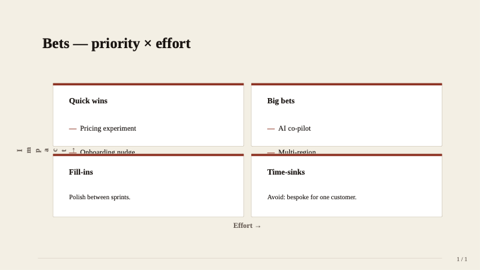

### team-grid
Contributors / advisory grid — 2–8 members.

- `title` — `text`, ≤ 50 chars. Optional.
- `members` — `bullets`, 2–8. Each `{ name, role?, image?, bio? }`.

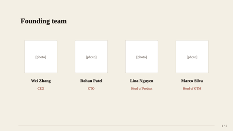

### image-full-bleed
Full-bleed image with optional caption band.

- `image` — `image-ref`. Required.
- `caption` — `text`, ≤ 120 chars. Optional.

### visual-with-caption
The signature layout for this theme: editorial photo with italic caption + uppercase credit. Use liberally.

- `image` — `image-ref`. Required.
- `caption` — `text-block`, ≤ 320 chars. Required.
- `credit` — `text`, ≤ 80 chars. Optional.

### visual-with-text
Visual + sibling text column. Replaces the older two-col-text-image / image-split-text / bullet-with-image. Pick `textKind` (prose or bullets) and `imageStyle` (card or bleed, image only).

- `title` — `text`, ≤ 60 chars. Optional.
- `visual` — `visual` ({ kind: "image" | "chart" | "table" | "svg", ... }). Optional (no visual → text fills slide).
- `textKind` — enum `prose` | `bullets`. Default `prose`.
- `text` — `text-block`, ≤ 1500 chars. Required when textKind=prose.
- `bullets` — `bullets`, 2-7 items × 140 chars. Required when textKind=bullets.
- `position` — enum `left` | `right`. Visual side. Default `right`.
- `imageStyle` — enum `card` | `bleed`. Image-only; chart/table/svg ignore it. Default `card`.
- `ratio` — text:visual width. Default `50-50`.
- `density` — `loose | normal | dense | micro`. Prose body density.

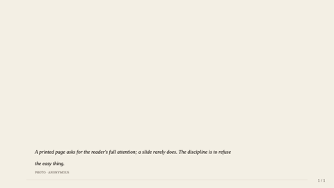

### hero-image-overlay
Full-bleed image with a translucent overlay carrying title + subtitle.

- `image` — `image-ref`. Required.
- `title` — `text`, ≤ 60 chars. Required.
- `subtitle` — `text`, ≤ 100 chars. Optional.
- `align` — `text` (anchor). Optional.

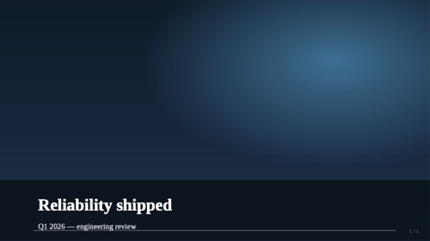

### compare-two-columns
Side-by-side panels for option A vs option B.

- `title` — `text`, ≤ 50 chars. Optional.
- `leftTitle`, `leftBody`, `rightTitle`, `rightBody`. Required.

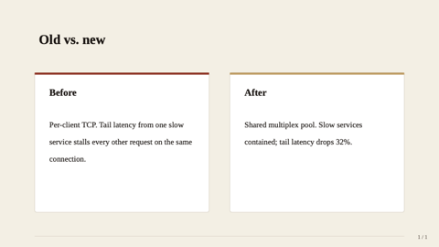

### data-table
Native table with editorial header row.

- `title` — `text`, ≤ 50 chars. Optional.
- `table` — `table`. Header + rows + optional `colWidths` / `align`.

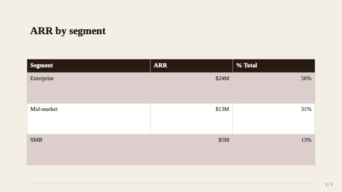

### quote
Pull-quote slide. Plays beautifully against the cream canvas.

- `quote` — `text-block`, ≤ 240 chars. Required.
- `attribution` — `text`, ≤ 60 chars. Optional.

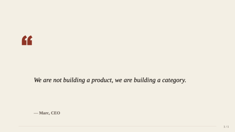

### key-point
Headline + 2–4 supporting points with icons.

- `headline` — `text`, ≤ 80 chars. Required.
- `points` — `bullets`, 2–4. Each `{ icon?, title, description? }`.

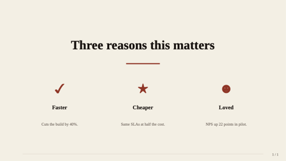

### pricing-table
2–4 tiers — useful for studio rate cards or membership tiers.

- `title` — `text`, ≤ 50 chars. Optional.
- `tiers` — `bullets`, 2–4 entries.

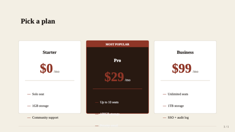

### prose
Single-column long-form text — the *signature* layout for this theme.

- `title` — `text`, ≤ 80. Optional.
- `subtitle` — `text`, ≤ 120. Optional.
- `body` — `text-block`, ≤ 1600. Required. Supports typed paragraphs `{ kind: "quote"|"note"|"callout"|"h2", text }`.

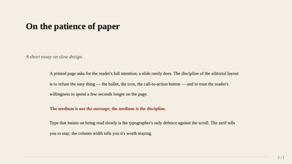

### executive-summary
Numbered TL;DR for essay front-pages.

- `title` — `text`, ≤ 60. Optional.
- `items` — `bullets`, 2–6 entries. Each `{ heading, line? }`.

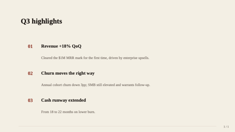

### q-and-a
1–5 question + answer pairs.

- `title` — `text`, ≤ 60. Optional.
- `items` — `bullets`, 1–5 entries. Each `{ q, a? }`.

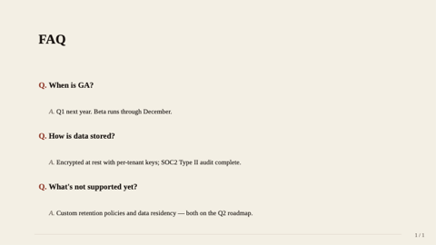

### definition
Single-term editorial dictionary page.

- `term` — `text`, ≤ 40. Required.
- `pronounce`, `partOfSpeech` — `text`. Optional.
- `body` — `text-block`, ≤ 600. Required.
- `example` — `text-block`, ≤ 240. Optional.

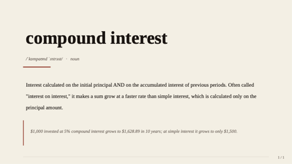

### outline
Multi-level table of contents — book / essay structure.

- `title` — `text`, ≤ 60. Optional.
- `items` — `bullets`, 2–8 entries.

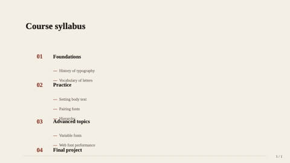

### letter
Open-letter format — the magazine voice incarnate.

- `date`, `recipient`, `signoff`, `signRole` — `text`. Optional.
- `body` — `text-block`, ≤ 1400. Required.
- `signature` — `text`, ≤ 60. Required.

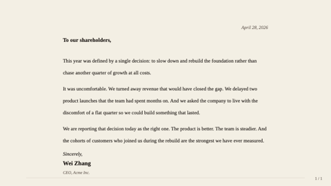

### glossary
Two-column term + definition list.

- `title` — `text`, ≤ 60. Optional.
- `terms` — `bullets`, 3–12 entries.

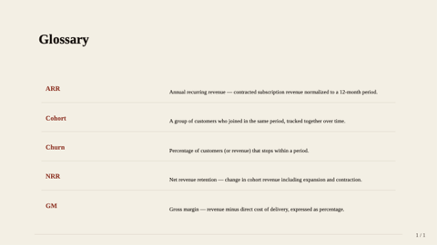

### framed
Five-region layout with optional edge bands.

- `title` — `text`, ≤ 50 chars. Optional.
- `header`, `footer`, `leftEdge`, `rightEdge` — `region`. Optional bands.
- `center` — `region`. Required.

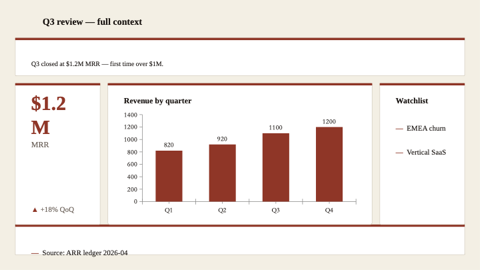

### freeform
Escape-hatch — pass `shapes: [{ kind, x, y, w, h, ... }]` directly.

- `title` — `text`, ≤ 80 chars. Optional.
- `shapes` — `bullets`, 1–40 entries.

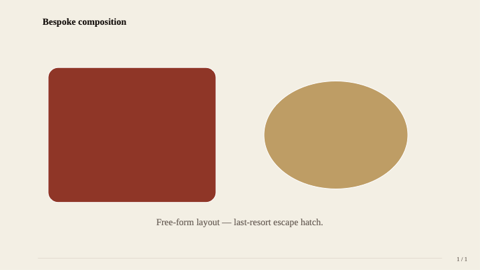

### closing
Mirror of cover — full-bleed deep-brown panel for the last "thank you" slide.

- `title` — `text`, ≤ 60 chars. Required.
- `subtitle` — `text`, ≤ 80 chars. Optional.
- `image` — `image-ref`. Optional full-bleed background image; renders under a 75% brand-deep overlay.

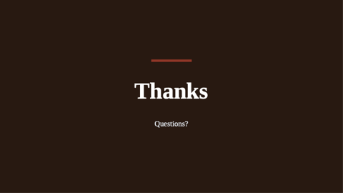

### code-block
Code snippet on a dark card with monospace text and an optional language badge.

- `title`, `language` — `text`. Optional.
- `code` — `text-block`, ≤ 1600 chars. Required.
- `caption` — `markdown-inline`, ≤ 160 chars. Optional.

> **Guidance:** Anti-pattern for editorial-paper — code disrupts the print rhythm. Use only when an essay genuinely cites code.

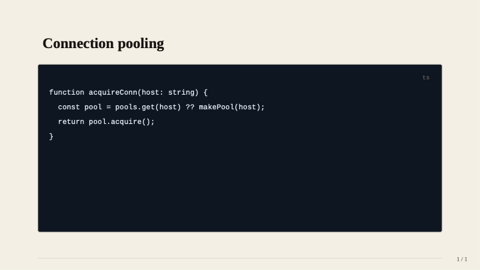

### dashboard
2×2 grid of polymorphic region cells.

- `title` — `text`, ≤ 50 chars. Optional.
- `tl`, `tr`, `bl`, `br` — `region`. Only `tl` required.

> **Guidance:** Strong anti-pattern for editorial-paper — dashboards belong in `technical-blue` / `midnight-executive`. Listed for completeness only.

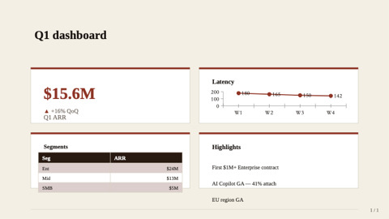
### timeline
Step or event sequence with a connecting rail and dots. Replaces the older timeline (horizontal step diagram) and timeline-text (vertical narrative timeline).

- `title` — `text`, ≤ 60 chars. Optional.
- `items` — `bullets`, 2-6 entries. Each `{ when?, title, description? }` (or a bare string treated as title). `when` renders in a left date column when direction=vertical.
- `direction` — enum `horizontal` (default — process diagram) | `vertical` (narrative timeline with optional date column).

### split
N polymorphic regions arranged in a row, column, or T-shape. Replaces split-2, split-3-horizontal, and split-3-vertical.

- `title` — `text`, ≤ 50 chars. Optional.
- `cell1`, `cell2` — `region`. Required.
- `cell3` — `region`. Optional (used when cells=3).
- `cells` — enum `2` | `3`. Default `2`.
- `direction` — enum `horizontal` (default) | `vertical` (only meaningful for cells=3 — produces T-shape: top row + 2-cell bottom).
- `ratio` — width/height ratio between cells. See enum values for direction-specific options.

### image-grid
Gallery of 2–4 images. Replaces image-pair and image-grid.

- `title` — `text`, ≤ 50 chars. Optional.
- `images` — `bullets`, 2-4 entries. Each `{ src, alt?, caption? }` or bare path string.
- count=2 (auto when 2 images supplied) renders side-by-side with optional uppercase label band above each image.
- count=4 renders 2×2 grid with each tile in a card and optional caption below.

### funnel
Conversion / sales funnel — 3–6 stages narrowing top-down.

- `title` — `text`, ≤ 42 chars. Optional.
- `stages` — `bullets`, 3–6. Each `{ label, value?, sublabel? }`. Width tapers uniformly; value/sublabel render in right column.

### process-flow
Causal A→B→C pipeline rendered as connected chevrons. Use over `timeline` when conveying STAGES (no dates), over `key-point` when order matters.

- `title` — `text`, ≤ 42 chars. Optional.
- `steps` — `bullets`, 2–8. Each `{ title, description? }`.
- `direction` — `enum`: `horizontal` (default) | `vertical`. Optional.

### swot
Fixed Strengths / Weaknesses / Opportunities / Threats quadrants with canonical color semantics. Distinct from `matrix-2x2` (which is generic axis-labelled quadrants).

- `title` — `text`, ≤ 42 chars. Optional. Defaults to "SWOT 分析" / "SWOT Analysis".
- `strengths`, `weaknesses`, `opportunities`, `threats` — `bullets`, 1–6 each.

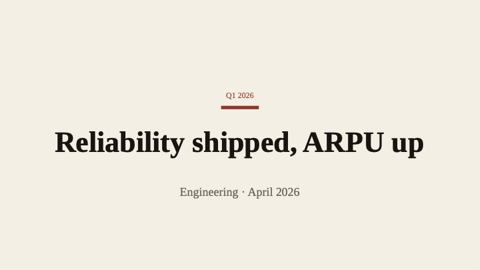

### content-grid
3–8 `{title, body}` cards in an auto-flex grid. Use over `key-point` (max 4) or `dashboard` (overkill for plain text) for the "I have N small content blocks" pattern.

- `title` — `text`, ≤ 42 chars. Optional.
- `items` — `bullets`, 3–8. Each `{ title, body? }`. Layout shape: 3→1×3, 4→2×2, 5–6→2×3, 7–8→2×4.

### roadmap
Gantt-style time × tracks. Periods axis (3–12 quarters/months) × tracks (1–7 work-stream lanes), each carrying phase bars that span one or more periods.

- `title` — `text`, ≤ 42 chars. Optional.
- `periods` — `bullets`, 3–12. Time bucket labels (`["Q1 2026", "Q2 2026", ...]`).
- `tracks` — `bullets`, 1–7. Each `{ name, bars: [{ start, end?, label?, status? }] }`. `start`/`end` are 0-based period indices. `status`: `planned|in-progress|done|at-risk|blocked` drives semantic color; otherwise track inherits a categorical color.

## Components

### header
Eyebrow + title block used internally by content layouts.

- `eyebrow` — `text`, ≤ 32 chars. Optional.
- `title` — `text`, ≤ 60 chars. Required.

### footer
Slide-bottom byline.

- `text` — `text`, ≤ 40 chars. Required.

### kpi-tile
A single KPI card. `value`, `label`, optional `delta`/`trend`.

### takeaway-callout
Boxed conclusion at the bottom of a content slide.

- `text` — `markdown-inline`, ≤ 160 chars. Required.

## Tokens

| Token | Value | Use |
|---|---|---|
| `bg-canvas` | #F4EFE3 | Cream paper canvas |
| `bg-card` | #FFFFFF | Card backings (rare in this theme — ghost/outlined preferred) |
| `brand-primary` | #9B2D20 | Oxblood — headline accent, title rules, KPI value |
| `brand-deep` | #2B1810 | Espresso brown — closing panel, header bar |
| `text-strong` | #1A1410 | Body / title — near-black with warm tint |
| `text-muted` | #6F635A | Captions, credits, page numbers |
| `accent` | #C49B5C | Brushed gold — secondary highlight |
| `divider` | #D8CFBF | Hairline rules and warm grays |
| `font-latin` | Source Serif 4 → Source Serif Pro → Crimson Pro → Georgia | Serif body — print-feel |
| `font-cjk`   | Source Han Serif SC → Songti SC → STSong → SimSun → Noto Serif CJK SC | Serif CJK — matches the editorial register |
| `font-mono`  | JetBrains Mono → Iosevka → Menlo → Consolas | Code (rare in this theme) |

## Chrome
- `hairline` — thin warm-gray rule along the bottom edge; quieter than `brand-bar`.
- `page-number` — bottom-right, muted, "n / N" format.

## Examples

A typical editorial-paper deck mixes `visual-with-caption`, `quote-with-portrait`,
and full-text `text-block` slides; uses `hero-stat` sparingly; and never
touches `dashboard` (pick `technical-blue` for that).
