# Editorial Paper

A magazine-style theme. Refined paper palette (cream canvas, oxblood
accent, brushed-gold detail), serif headlines, asymmetric margins,
hairline rules. Designed to make a slide read like a printed page —
considered, literary, paced.

## When to use this theme
- Founder letters, year-end essays, "state of the company" pieces.
- Long-form reports that will be printed.
- Design / culture / editorial content where the reading experience matters.
- Annual-report or museum-catalogue style slides.

## When NOT to use
- Engineering reviews (use `technical-blue`).
- Sales pitches and quarterly KPIs (use `midnight-executive`).
- Any deck with a hard data-density requirement — the serifs and generous
  margins burn space.
- Big-room keynotes — the tone is intimate, not amphitheater-scale.

## Layout reference

### cover
Title with eyebrow + subtitle. Use for slide 1.

- `title` — `text`, ≤ 60 chars. Required.
- `subtitle` — `text`, ≤ 80 chars. Optional.
- `eyebrow` — `text`, ≤ 32 chars. Optional. Renders in small uppercase.

### title-only
Centered title. Use as a chapter break or section pause.

- `title` — `text`, ≤ 80 chars. Required.

### agenda
Numbered list of essay sections.

- `title` — `text`, ≤ 30 chars. Optional.
- `items` — `bullets`, 2–8 entries.

### section-divider
Section break.

- `eyebrow` — `text`, ≤ 32 chars. Optional.
- `title` — `text`, ≤ 50 chars. Required.

### stat-grid-3
Three KPI tiles. In this theme renders with the cream card backing.

- `title` — `text`, ≤ 40 chars. Required.
- `items` — `bullets`, exactly 3 entries.

### hero-stat
One enormous headline number — perfect for the deck's load-bearing fact.

- `value` — `text`, ≤ 20 chars. Required.
- `label` — `text`, ≤ 60 chars. Required.
- `caption` — `text-block`, ≤ 240 chars. Optional.
- `eyebrow` — `text`, ≤ 32 chars. Optional.

### matrix-2x2
Editorial 2×2 framework.

- `title`, `xLabel`, `yLabel` — `text`. Optional.
- `topLeft`, `topRight`, `botLeft`, `botRight` — `region` cells.

### team-grid
Contributors / advisory grid — 2–8 members.

- `title` — `text`, ≤ 50 chars. Optional.
- `members` — `bullets`, 2–8. Each `{ name, role?, image?, bio? }`.

### image-full-bleed
Full-bleed image with optional caption band.

- `image` — `image-ref`. Required.
- `caption` — `text`, ≤ 120 chars. Optional.

### image-with-caption
The signature layout for this theme: editorial photo with italic caption + uppercase credit. Use liberally.

- `image` — `image-ref`. Required.
- `caption` — `text-block`, ≤ 320 chars. Required.
- `credit` — `text`, ≤ 80 chars. Optional.

### image-pair
Two images side by side — diptych or before/after.

- `title` — `text`, ≤ 50 chars. Optional.
- `leftImage`, `rightImage` — `image-ref`. Required.
- `leftLabel`, `rightLabel` — `text`, ≤ 32 chars. Optional.

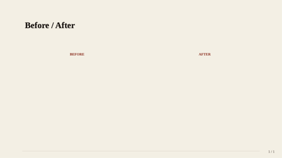

### image-split-text
Immersive 50/50 split — full-bleed image vs serif body text.

- `title` — `text`, ≤ 60 chars. Required.
- `text` — `text-block`, ≤ 480 chars. Required.
- `image` — `image-ref`. Required.
- `imageSide` — `text` (left|right). Optional.

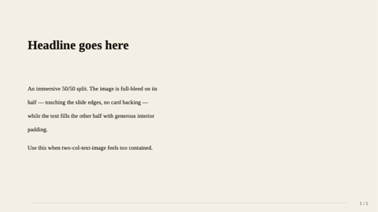

### hero-image-overlay
Full-bleed image with a translucent overlay carrying title + subtitle.

- `image` — `image-ref`. Required.
- `title` — `text`, ≤ 60 chars. Required.
- `subtitle` — `text`, ≤ 100 chars. Optional.
- `align` — `text` (anchor). Optional.

### bullet-with-image
Title + 3–6 bullets on the left, image on the right.

- `title` — `text`, ≤ 50 chars. Required.
- `bullets` — `bullets`, 3–6 entries.
- `image` — `image-ref`. Optional.

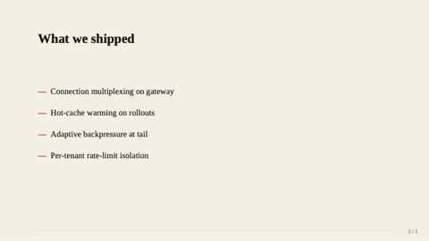

### two-col-text-image
Title + text-block on one side, image on the other.

- `title` — `text`, ≤ 50 chars. Required.
- `text` — `text-block`, ≤ 400 chars. Required.
- `image` — `image-ref`. Required.
- `imageSide` — `text` (left|right). Optional.

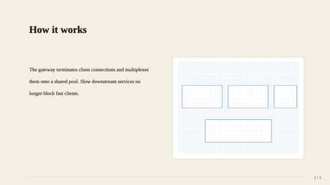

### compare-two-columns
Side-by-side panels for option A vs option B.

- `title` — `text`, ≤ 50 chars. Optional.
- `leftTitle`, `leftBody`, `rightTitle`, `rightBody`. Required.

### process-timeline
3–5 steps along a horizontal rail.

- `title` — `text`, ≤ 50 chars. Required.
- `steps` — `bullets`, 3–5 entries.

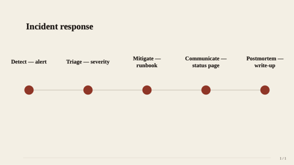

### image-grid-2x2
Up to 4 images in a 2×2 grid.

- `title` — `text`, ≤ 50 chars. Optional.
- `images` — `bullets`, 2–4 entries.

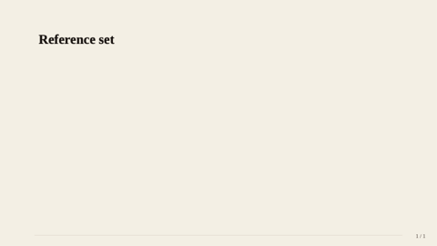

### data-table
Native table with editorial header row.

- `title` — `text`, ≤ 50 chars. Optional.
- `table` — `table`. Header + rows + optional `colWidths` / `align`.

### quote
Pull-quote slide. Plays beautifully against the cream canvas.

- `quote` — `text-block`, ≤ 240 chars. Required.
- `attribution` — `text`, ≤ 60 chars. Optional.

### quote-with-portrait
Pull-quote with a circular portrait of the speaker.

- `quote` — `text-block`, ≤ 280 chars. Required.
- `name` — `text`, ≤ 60 chars. Required.
- `role` — `text`, ≤ 80 chars. Optional.
- `portrait` — `image-ref`. Optional.

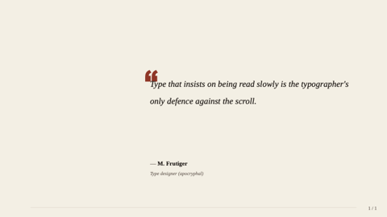

### chart-with-takeaway
Title + native chart + boxed conclusion. Charts render in the brand
oxblood + brushed-gold palette.

- `title` — `text`, ≤ 50 chars. Required.
- `chart` — `chart-spec`. Required.
- `takeaway` — `markdown-inline`, ≤ 160 chars. Optional.

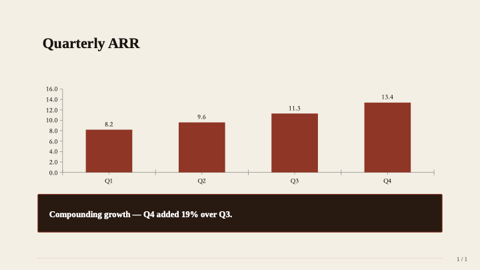

### key-point
Headline + 2–4 supporting points with icons.

- `headline` — `text`, ≤ 80 chars. Required.
- `points` — `bullets`, 2–4. Each `{ icon?, title, description? }`.

### pricing-table
2–4 tiers — useful for studio rate cards or membership tiers.

- `title` — `text`, ≤ 50 chars. Optional.
- `tiers` — `bullets`, 2–4 entries.

### split-2
Optional title over two heterogeneous region cells.

- `title` — `text`, ≤ 50 chars. Optional.
- `left`, `right` — `region` cells. Required.

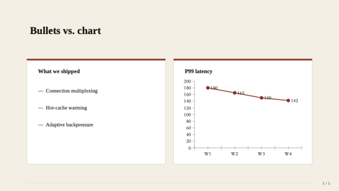

### split-3-horizontal
Optional title over three equal-width region cells.

- `title` — `text`, ≤ 50 chars. Optional.
- `left`, `center`, `right` — `region` cells. Required.

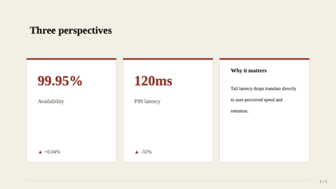

### split-3-vertical
Optional title; full-width top region over a 50/50 bottom row.

- `title` — `text`, ≤ 50 chars. Optional.
- `top` — `region`. Required.
- `bl`, `br` — `region`. Optional.

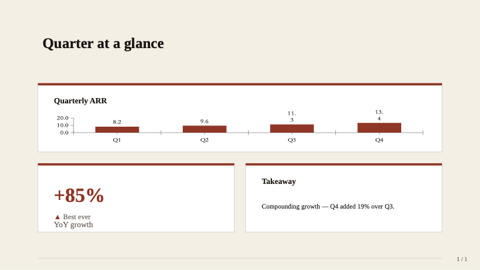

### prose
Single-column long-form text — the *signature* layout for this theme.

- `title` — `text`, ≤ 80. Optional.
- `subtitle` — `text`, ≤ 120. Optional.
- `body` — `text-block`, ≤ 1600. Required. Supports typed paragraphs `{ kind: "quote"|"note"|"callout"|"h2", text }`.

### two-column-prose
Magazine-style body flowed across two columns. Editorial-paper essential.

- `title`, `subtitle` — `text`. Optional.
- `body` — `text-block`, ≤ 2400. Required.

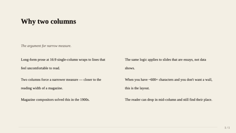

### executive-summary
Numbered TL;DR for essay front-pages.

- `title` — `text`, ≤ 60. Optional.
- `items` — `bullets`, 2–6 entries. Each `{ heading, line? }`.

### q-and-a
1–5 question + answer pairs.

- `title` — `text`, ≤ 60. Optional.
- `items` — `bullets`, 1–5 entries. Each `{ q, a? }`.

### definition
Single-term editorial dictionary page.

- `term` — `text`, ≤ 40. Required.
- `pronounce`, `partOfSpeech` — `text`. Optional.
- `body` — `text-block`, ≤ 600. Required.
- `example` — `text-block`, ≤ 240. Optional.

### outline
Multi-level table of contents — book / essay structure.

- `title` — `text`, ≤ 60. Optional.
- `items` — `bullets`, 2–8 entries.

### timeline-text
Vertical narrative timeline — perfect for company history slides.

- `title` — `text`, ≤ 60. Optional.
- `events` — `bullets`, 2–6 entries.

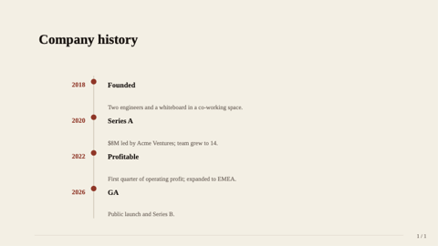

### letter
Open-letter format — the magazine voice incarnate.

- `date`, `recipient`, `signoff`, `signRole` — `text`. Optional.
- `body` — `text-block`, ≤ 1400. Required.
- `signature` — `text`, ≤ 60. Required.

### glossary
Two-column term + definition list.

- `title` — `text`, ≤ 60. Optional.
- `terms` — `bullets`, 3–12 entries.

### framed
Five-region layout with optional edge bands.

- `title` — `text`, ≤ 50 chars. Optional.
- `header`, `footer`, `leftEdge`, `rightEdge` — `region`. Optional bands.
- `center` — `region`. Required.

### freeform
Escape-hatch — pass `shapes: [{ kind, x, y, w, h, ... }]` directly.

- `title` — `text`, ≤ 80 chars. Optional.
- `shapes` — `bullets`, 1–40 entries.

### closing
Mirror of cover — full-bleed deep-brown panel for the last "thank you" slide.

- `title` — `text`, ≤ 60 chars. Required.
- `subtitle` — `text`, ≤ 80 chars. Optional.

### code-block
Code snippet on a dark card with monospace text and an optional language badge.

- `title`, `language` — `text`. Optional.
- `code` — `text-block`, ≤ 1600 chars. Required.
- `caption` — `markdown-inline`, ≤ 160 chars. Optional.

> **Guidance:** Anti-pattern for editorial-paper — code disrupts the print rhythm. Use only when an essay genuinely cites code.

### dashboard
2×2 grid of polymorphic region cells.

- `title` — `text`, ≤ 50 chars. Optional.
- `tl`, `tr`, `bl`, `br` — `region`. Only `tl` required.

> **Guidance:** Strong anti-pattern for editorial-paper — dashboards belong in `technical-blue` / `midnight-executive`. Listed for completeness only.

## Components

### header
Eyebrow + title block used internally by content layouts.

- `eyebrow` — `text`, ≤ 32 chars. Optional.
- `title` — `text`, ≤ 60 chars. Required.

### footer
Slide-bottom byline.

- `text` — `text`, ≤ 40 chars. Required.

### kpi-tile
A single KPI card. `value`, `label`, optional `delta`/`trend`.

### takeaway-callout
Boxed conclusion at the bottom of a content slide.

- `text` — `markdown-inline`, ≤ 160 chars. Required.

## Tokens

| Token | Value | Use |
|---|---|---|
| `bg-canvas` | #F4EFE3 | Cream paper canvas |
| `bg-card` | #FFFFFF | Card backings (rare in this theme — ghost/outlined preferred) |
| `brand-primary` | #9B2D20 | Oxblood — headline accent, title rules, KPI value |
| `brand-deep` | #2B1810 | Espresso brown — closing panel, header bar |
| `text-strong` | #1A1410 | Body / title — near-black with warm tint |
| `text-muted` | #6F635A | Captions, credits, page numbers |
| `accent` | #C49B5C | Brushed gold — secondary highlight |
| `divider` | #D8CFBF | Hairline rules and warm grays |
| `font-latin` | Source Serif 4 → Source Serif Pro → Crimson Pro → Georgia | Serif body — print-feel |
| `font-cjk`   | Source Han Serif SC → Songti SC → STSong → SimSun → Noto Serif CJK SC | Serif CJK — matches the editorial register |
| `font-mono`  | JetBrains Mono → Iosevka → Menlo → Consolas | Code (rare in this theme) |

## Chrome
- `hairline` — thin warm-gray rule along the bottom edge; quieter than `brand-bar`.
- `page-number` — bottom-right, muted, "n / N" format.

## Examples

A typical editorial-paper deck mixes `image-with-caption`, `quote-with-portrait`,
and full-text `text-block` slides; uses `hero-stat` sparingly; and never
touches `dashboard` (pick `technical-blue` for that).
