# Editorial Warm

Editorial / consulting theme with a cream canvas, deep warm grays, and
a rust accent. Serif headings, sans body. Print-friendly. Six core
layouts — pair with `technical-blue` when you need code, tables, or
process diagrams.

## When to use this theme
- Investor narratives and consulting briefs (warm, classical).
- Strategy memos that read more like prose than a dashboard.
- Print-oriented hand-outs.

## When NOT to use
- Engineering / data-dense decks (`technical-blue` is denser).
- Code walkthroughs (no `code-block` here).

## Layout reference

### cover
Title slide. Pick for slide 1 only. Uses chrome `none` automatically.

- `title` — `text`, ≤ 60 chars. Required.
- `subtitle` — `text`, ≤ 80 chars. Optional.
- `eyebrow` — `text`, ≤ 32 chars. Optional. Small label above the title.

### agenda
Numbered list of upcoming sections (TOC).

- `title` — `text`, ≤ 30 chars. Optional (defaults to "Agenda").
- `items` — `bullets`, 2–8 items, ≤ 60 chars each.

### stat-grid-3
Three KPI tiles in a row. Pick when surfacing 3 headline metrics.

- `title` — `text`, ≤ 40 chars.
- `items` — `bullets`, exactly 3, each `{ value, label, delta?, trend? }`.

### chart-with-takeaway
Title + native data chart + boxed conclusion.

- `title` — `text`, ≤ 50 chars.
- `chart` — `chart-spec`. See parser docs for shape.
- `takeaway` — `markdown-inline`, ≤ 160 chars. Optional.

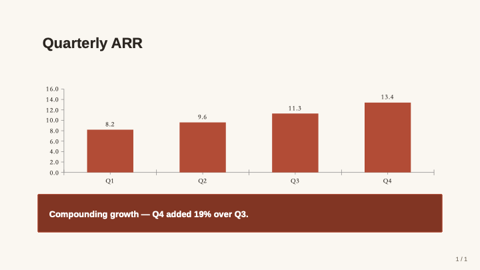

### bullet-with-image
Title + 3–6 bullets on the left, image on the right (optional).

- `title` — `text`, ≤ 50 chars.
- `bullets` — `bullets`, 3–6 items, ≤ 80 chars each.
- `image` — `image-ref`. Optional.

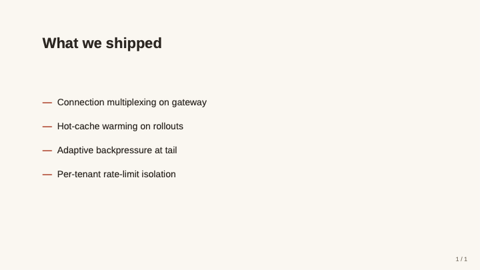

### closing
Mirror of `cover` — full-bleed deep panel. Use as the final "thank you" slide.

- `title` — `text`, ≤ 60 chars.
- `subtitle` — `text`, ≤ 80 chars. Optional.

### split-2
Title (optional) over two side-by-side cells; each cell is a polymorphic `region` (one of 8 kinds: kpi/chart/table/text/bullets/image/code/quote). Use for heterogeneous side-by-side content (bullets vs. chart, image vs. quote, code vs. explanation).

- `title` — `text`, ≤ 50 chars. Optional.
- `left`, `right` — `region` cells (required).

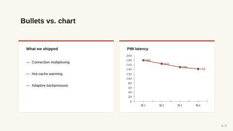

### split-3-horizontal
Title (optional) over three equal-width regions. Use for parallel comparison.

- `title` — `text`, ≤ 50 chars. Optional.
- `left`, `center`, `right` — `region` cells (required).

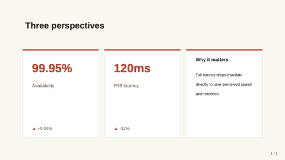

### split-3-vertical
Title (optional); full-width top region over a 50/50 bottom row. Use for "headline + supporting evidence".

- `title` — `text`, ≤ 50 chars. Optional.
- `top` — `region` (required, full width).
- `bl`, `br` — `region` cells (optional, bottom 50/50).

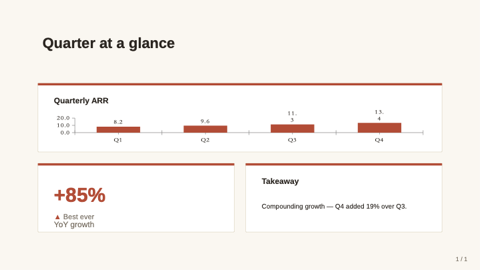

### hero-stat
One enormous headline number for the deck's load-bearing insight.

- `value` — `text`, ≤ 20 chars. Required.
- `label` — `text`, ≤ 60 chars. Required.
- `caption` — `text-block`, ≤ 240 chars. Optional.
- `eyebrow` — `text`, ≤ 32 chars. Optional.

### matrix-2x2
Editorial 2×2 framework with axis labels.

- `title` — `text`, ≤ 50 chars. Optional.
- `xLabel`, `yLabel` — `text`, ≤ 32 chars. Optional.
- `topLeft`, `topRight`, `botLeft`, `botRight` — `region` cells.

### team-grid
Contributors / advisory grid — 2–8 members.

- `title` — `text`, ≤ 50 chars. Optional.
- `members` — `bullets`, 2–8 entries. Each `{ name, role?, image?, bio? }`.

### image-full-bleed
Image fills the entire slide; optional `caption`.

- `image` — `image-ref`. Required.
- `caption` — `text`, ≤ 120 chars. Optional.

### image-with-caption
Magazine-style image + italic caption + optional uppercase credit.

- `image` — `image-ref`. Required.
- `caption` — `text-block`, ≤ 320 chars. Required.
- `credit` — `text`, ≤ 80 chars. Optional.

### image-pair
Two side-by-side images.

- `title` — `text`, ≤ 50 chars. Optional.
- `leftImage`, `rightImage` — `image-ref`. Required.
- `leftLabel`, `rightLabel` — `text`, ≤ 32 chars. Optional.

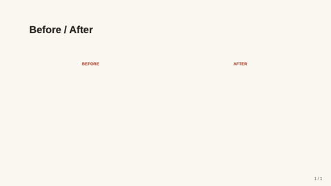

### image-split-text
Immersive 50/50 — full-bleed image vs editorial text.

- `title` — `text`, ≤ 60 chars. Required.
- `text` — `text-block`, ≤ 480 chars. Required.
- `image` — `image-ref`. Required.
- `imageSide` — `text` (left|right). Optional.

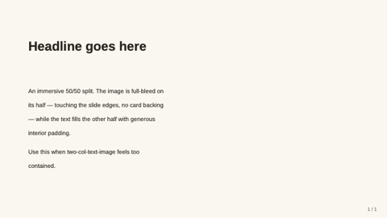

### pricing-table
2–4 pricing tiers.

- `title` — `text`, ≤ 50 chars. Optional.
- `tiers` — `bullets`, 2–4. `{ name, price, period?, features?, recommended? }`.

### quote-with-portrait
Pull-quote with circular portrait — humane editorial source attribution.

- `quote` — `text-block`, ≤ 280 chars. Required.
- `name` — `text`, ≤ 60 chars. Required.
- `role` — `text`, ≤ 80 chars. Optional.
- `portrait` — `image-ref`. Optional.

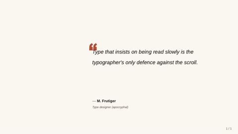

### key-point
Headline + 2–4 supporting points with icons.

- `headline` — `text`, ≤ 80 chars. Required.
- `points` — `bullets`, 2–4. Each `{ icon?, title, description? }`.

### freeform
Escape-hatch — `shapes: [{ kind, x, y, w, h, ... }]`.

- `title` — `text`, ≤ 80 chars. Optional.
- `shapes` — `bullets`, 1–40 entries.

### prose
Single-column long-form text — the editorial workhorse.

- `title` — `text`, ≤ 80. Optional.
- `subtitle` — `text`, ≤ 120. Optional.
- `body` — `text-block`, ≤ 1600. Required.

### two-column-prose
Magazine-feel body flowed across two columns.

- `title`, `subtitle` — `text`. Optional.
- `body` — `text-block`, ≤ 2400. Required.

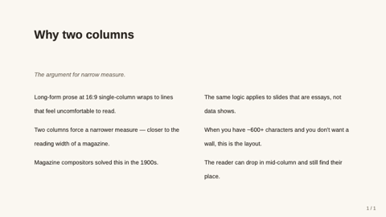

### executive-summary
Numbered TL;DR for memo front-pages.

- `title` — `text`, ≤ 60. Optional.
- `items` — `bullets`, 2–6 entries. Each `{ heading, line? }`.

### q-and-a
1–5 question + answer pairs.

- `title` — `text`, ≤ 60. Optional.
- `items` — `bullets`, 1–5 entries. Each `{ q, a? }`.

### definition
Single-term editorial dictionary page.

- `term` — `text`, ≤ 40. Required.
- `pronounce`, `partOfSpeech` — `text`. Optional.
- `body` — `text-block`, ≤ 600. Required.
- `example` — `text-block`, ≤ 240. Optional.

### outline
Multi-level table of contents.

- `title` — `text`, ≤ 60. Optional.
- `items` — `bullets`, 2–8 entries.

### timeline-text
Vertical narrative timeline.

- `title` — `text`, ≤ 60. Optional.
- `events` — `bullets`, 2–6 entries. Each `{ when, title, body? }`.

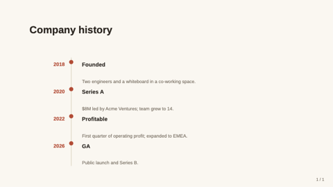

### letter
Open-letter format — quintessential editorial-warm slide.

- `date`, `recipient`, `signoff`, `signRole` — `text`. Optional.
- `body` — `text-block`, ≤ 1400. Required.
- `signature` — `text`, ≤ 60. Required.

### glossary
Two-column term + definition list.

- `title` — `text`, ≤ 60. Optional.
- `terms` — `bullets`, 3–12 entries.

### framed
Five-region layout — header / footer / left / right edges plus a center.

- `title` — `text`, ≤ 50 chars. Optional.
- `header`, `footer`, `leftEdge`, `rightEdge` — `region`. Optional.
- `center` — `region`. Required.

### title-only
Single centered title — chapter break.

- `title` — `text`, ≤ 80 chars. Required.

### section-divider
Section break with optional eyebrow.

- `eyebrow` — `text`, ≤ 32 chars. Optional.
- `title` — `text`, ≤ 50 chars. Required.

### two-col-text-image
Title + text-block on one side, image on the other.

- `title` — `text`, ≤ 50 chars. Required.
- `text` — `text-block`, ≤ 400 chars. Required.
- `image` — `image-ref`. Required.
- `imageSide` — `text` (left|right). Optional.

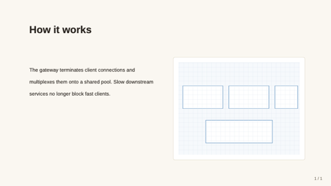

### compare-two-columns
Side-by-side option A vs option B.

- `title` — `text`, ≤ 50 chars. Optional.
- `leftTitle`, `leftBody`, `rightTitle`, `rightBody` — required.

### process-timeline
3–5 steps along a horizontal rail.

- `title` — `text`, ≤ 50 chars. Required.
- `steps` — `bullets`, 3–5 entries.

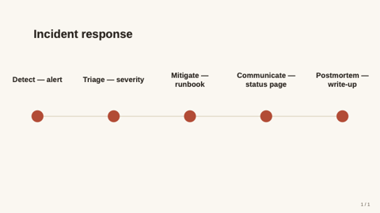

### image-grid-2x2
Up to 4 images in a 2×2 grid.

- `title` — `text`, ≤ 50 chars. Optional.
- `images` — `bullets`, 2–4 entries.

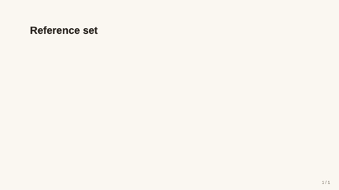

### hero-image-overlay
Full-bleed image with translucent overlay carrying title + subtitle.

- `image` — `image-ref`. Required.
- `title` — `text`, ≤ 60 chars. Required.
- `subtitle` — `text`, ≤ 100 chars. Optional.
- `align` — `text`. Optional.

### data-table
Native table — header row + alternating row fills.

- `title` — `text`, ≤ 50 chars. Optional.
- `table` — `table`. Required.

### quote
Pull-quote slide.

- `quote` — `text-block`, ≤ 240 chars. Required.
- `attribution` — `text`, ≤ 60 chars. Optional.

### code-block
Code snippet on a dark card.

- `title` — `text`, ≤ 50 chars. Optional.
- `language` — `text`, ≤ 16 chars. Optional.
- `code` — `text-block`, ≤ 1600 chars. Required.
- `caption` — `markdown-inline`, ≤ 160 chars. Optional.

> **Guidance:** Anti-pattern for an editorial theme — prefer `technical-blue` for code-heavy decks. Available for the rare exception (a memo that includes a single config snippet).

### dashboard
2×2 grid of polymorphic region cells.

- `title` — `text`, ≤ 50 chars. Optional.
- `tl`, `tr`, `bl`, `br` — `region`. Only `tl` required.

> **Guidance:** Anti-pattern for an editorial theme — dashboards belong in `technical-blue` / `midnight-executive`.

## Tokens

| Token | Value | Use |
|---|---|---|
| `font-latin` | Source Sans 3 → Source Sans Pro → Helvetica → Arial | Body sans (clean editorial weight) |
| `font-cjk` | Source Han Serif SC → PingFang SC → MS YaHei → Noto Sans CJK SC | Serif-leaning CJK to match the editorial tone — falls back gracefully to PingFang on macOS Office |
| `font-mono` | JetBrains Mono → Iosevka → Menlo → Consolas | Used only for code-block (rare in this theme) |
| `bg-canvas` | #FBF7F0 | Cream slide background |
| `bg-card` | #FFFFFF | Card backings |
| `brand-primary` | #C0432D | Rust accent — title rules, KPI value |
| `brand-deep` | #8C2E1B | Header bar / closing panel |
| `text-strong` | #2C2620 | Body and titles |
| `text-muted` | #7A6F62 | Captions and subtitles |
| `accent` | #A88859 | Secondary accent (gold) |
| `divider` | #E5DCC9 | Hairlines and card borders |
