# Editorial Warm

Editorial / consulting theme with a cream canvas, deep warm grays, and
a rust accent. Serif headings, sans body. Print-friendly. Six core
layouts — pair with `technical-blue` when you need code, tables, or
process diagrams.

## When to use this theme
- Investor narratives and consulting briefs (warm, classical).
- Strategy memos that read more like prose than a dashboard.
- Print-oriented hand-outs.

## When NOT to use
- Engineering / data-dense decks (`technical-blue` is denser).
- Code walkthroughs (no `code-block` here).

## How to pick a layout

A 7-line decision tree. Scan top-to-bottom; first match wins.

1. **Long text (>500 CJK / 800 latin chars)?** → `article-flow`.
2. **Image is the point?** → `visual-with-caption` (editorial) / `image-full-bleed` (cinematic) / `image-pair` (before/after).
3. **Image + supporting text?** → `visual-with-text` (visual + sibling text column; imageStyle: card or bleed). Pick `density` matching content length.
4. **Data?** → `chart-with-takeaway` (1 chart) / `data-table` (table) / `stat-grid-3` (3 KPIs) / `dashboard` (4 mixed).
5. **3-6 short points?** → `executive-summary` (with descriptions) / `visual-with-text` (textKind: bullets) / `key-point` (with icons).
6. **Side-by-side comparison?** → `compare-two-columns` / `split-2` (heterogeneous, with `ratio`).
7. **Nothing fits?** → `freeform` (last resort).

When text exceeds a layout text budget, the validator emits `SLOT_OVERFLOW` with a concrete suggestion to switch to `article-flow` or split content.

## Layout reference

### cover
Title slide. Pick for slide 1 only. Uses chrome `none` automatically.

- `title` — `text`, ≤ 60 chars. Required.
- `subtitle` — `text`, ≤ 80 chars. Optional.
- `eyebrow` — `text`, ≤ 32 chars. Optional. Small label above the title.

### agenda
Numbered list of upcoming sections (TOC).

- `title` — `text`, ≤ 30 chars. Optional (defaults to "Agenda").
- `items` — `bullets`, 2–8 items, ≤ 60 chars each.

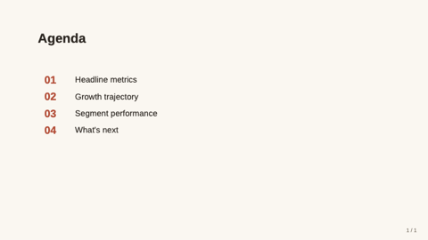

### stat-grid-3
Three KPI tiles in a row. Pick when surfacing 3 headline metrics.

- `title` — `text`, ≤ 40 chars.
- `items` — `bullets`, exactly 3, each `{ value, label, delta?, trend? }`.

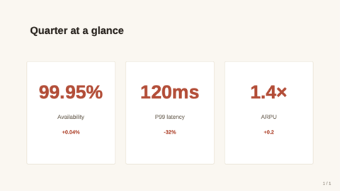

### closing
Mirror of `cover` — full-bleed deep panel. Use as the final "thank you" slide.

- `title` — `text`, ≤ 60 chars.
- `subtitle` — `text`, ≤ 80 chars. Optional.
- `image` — `image-ref`. Optional full-bleed background image; renders under a 75% brand-deep overlay.

### hero-stat
One enormous headline number for the deck's load-bearing insight.

- `value` — `text`, ≤ 20 chars. Required.
- `label` — `text`, ≤ 60 chars. Required.
- `caption` — `text-block`, ≤ 240 chars. Optional.
- `eyebrow` — `text`, ≤ 32 chars. Optional.

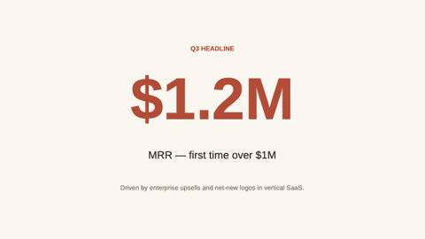

### matrix-2x2
Editorial 2×2 framework with axis labels.

- `title` — `text`, ≤ 50 chars. Optional.
- `xLabel`, `yLabel` — `text`, ≤ 32 chars. Optional.
- `topLeft`, `topRight`, `botLeft`, `botRight` — `region` cells.

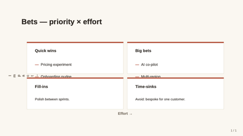

### team-grid
Contributors / advisory grid — 2–8 members.

- `title` — `text`, ≤ 50 chars. Optional.
- `members` — `bullets`, 2–8 entries. Each `{ name, role?, image?, bio? }`.

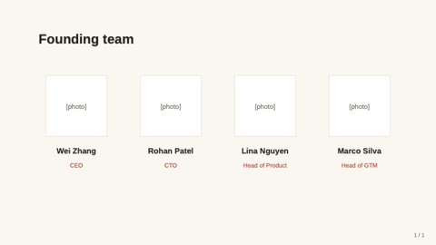

### image-full-bleed
Image fills the entire slide; optional `caption`.

- `image` — `image-ref`. Required.
- `caption` — `text`, ≤ 120 chars. Optional.

### visual-with-caption
Magazine-style image + italic caption + optional uppercase credit.

- `image` — `image-ref`. Required.
- `caption` — `text-block`, ≤ 320 chars. Required.
- `credit` — `text`, ≤ 80 chars. Optional.

### visual-with-text
Visual + sibling text column. Replaces the older two-col-text-image / image-split-text / bullet-with-image. Pick `textKind` (prose or bullets) and `imageStyle` (card or bleed, image only).

- `title` — `text`, ≤ 60 chars. Optional.
- `visual` — `visual` ({ kind: "image" | "chart" | "table" | "svg", ... }). Optional (no visual → text fills slide).
- `textKind` — enum `prose` | `bullets`. Default `prose`.
- `text` — `text-block`, ≤ 1500 chars. Required when textKind=prose.
- `bullets` — `bullets`, 2-7 items × 140 chars. Required when textKind=bullets.
- `position` — enum `left` | `right`. Visual side. Default `right`.
- `imageStyle` — enum `card` | `bleed`. Image-only; chart/table/svg ignore it. Default `card`.
- `ratio` — text:visual width. Default `50-50`.
- `density` — `loose | normal | dense | micro`. Prose body density.

### pricing-table
2–4 pricing tiers.

- `title` — `text`, ≤ 50 chars. Optional.
- `tiers` — `bullets`, 2–4. `{ name, price, period?, features?, recommended? }`.

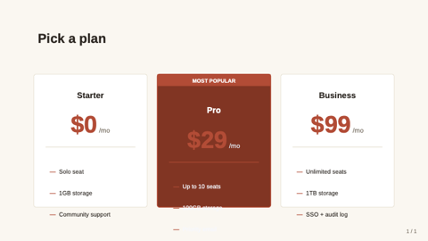

### key-point
Headline + 2–4 supporting points with icons.

- `headline` — `text`, ≤ 80 chars. Required.
- `points` — `bullets`, 2–4. Each `{ icon?, title, description? }`.

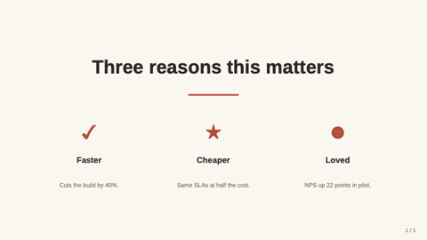

### freeform
Escape-hatch — `shapes: [{ kind, x, y, w, h, ... }]`.

- `title` — `text`, ≤ 80 chars. Optional.
- `shapes` — `bullets`, 1–40 entries.

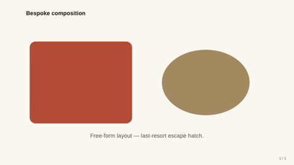

### article-flow
Logical long article / reading passage. One SlideML logical slide expands to as many PPTX slides as needed. Use for source articles, reading materials, long essays, transcripts, or rich text that must remain editable as one unit.

- `title` — `text`, ≤ 64 chars. Required.
- `subtitle` — `text`, ≤ 96 chars. Optional.
- `body` — `article-blocks`. Required. Accepts a string or blocks: paragraph, heading, quote, note, code, list, image. Text blocks can split across rendered pages.
- `columns` — `auto|1|2`. Optional, default `auto`. Auto chooses 2 columns for long passages.
- `mode` — `passage|essay|handout`. Optional, default `passage`.
- `pageMarker` — `auto|none`. Optional, default `auto`.

> **Guidance:** Use this for full source articles or reading passages. Keep the entire article in one logical slide; the renderer paginates into multiple PPTX slides and keeps continuation markers.

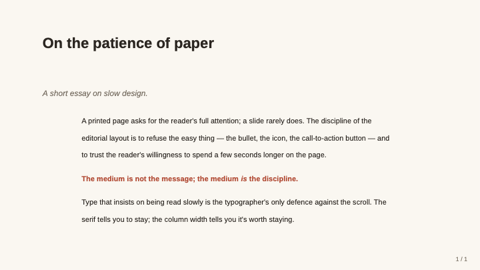

### executive-summary
Numbered TL;DR for memo front-pages.

- `title` — `text`, ≤ 60. Optional.
- `items` — `bullets`, 2–6 entries. Each `{ heading, line? }`.

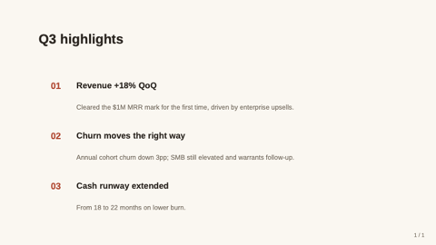

### question-list
Question/prompt list. 1–5 items with optional response/detail. Default labels: none. Use for exam questions, answer-choice blocks, review prompts, or FAQ entries.

- `title` — `text`, ≤ 42 chars. Optional.
- `labels` — `none|qa`. Optional, default `none`; use `qa` only for FAQ pages that need Q./A. markers.
- `items` — `bullets`, 1–5 entries. Each `{ label?, detail?, response? }` for exam items, or `{ q | question, a | answer? }` for FAQ-style pairs.

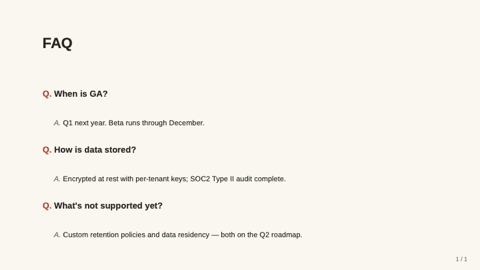

### definition
Single-term editorial dictionary page.

- `term` — `text`, ≤ 40. Required.
- `pronounce`, `partOfSpeech` — `text`. Optional.
- `body` — `text-block`, ≤ 600. Required.
- `example` — `text-block`, ≤ 240. Optional.

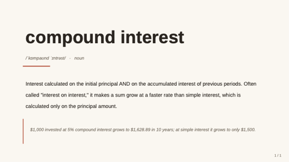

### outline
Multi-level table of contents.

- `title` — `text`, ≤ 60. Optional.
- `items` — `bullets`, 2–8 entries.

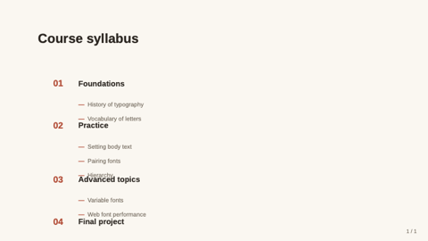

### letter
Open-letter format — quintessential editorial-warm slide.

- `date`, `recipient`, `signoff`, `signRole` — `text`. Optional.
- `body` — `text-block`, ≤ 1400. Required.
- `signature` — `text`, ≤ 60. Required.

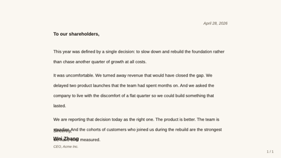

### glossary
Two-column term + definition list.

- `title` — `text`, ≤ 60. Optional.
- `terms` — `bullets`, 3–12 entries.

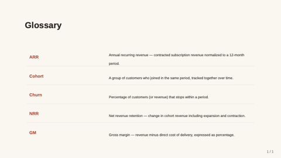

### framed
Five-region layout — header / footer / left / right edges plus a center.

- `title` — `text`, ≤ 50 chars. Optional.
- `header`, `footer`, `leftEdge`, `rightEdge` — `region`. Optional.
- `center` — `region`. Required.

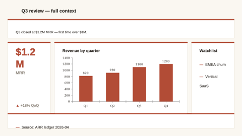

### title-only
Single centered title — chapter break.

- `title` — `text`, ≤ 80 chars. Required.

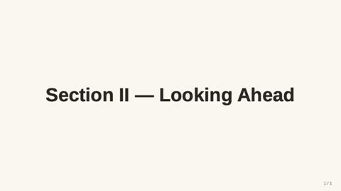

### section-divider
Section break with optional eyebrow.

- `eyebrow` — `text`, ≤ 32 chars. Optional.
- `title` — `text`, ≤ 50 chars. Required.

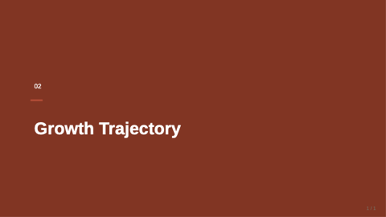

### compare-two-columns
Side-by-side option A vs option B.

- `title` — `text`, ≤ 50 chars. Optional.
- `leftTitle`, `leftBody`, `rightTitle`, `rightBody` — required.

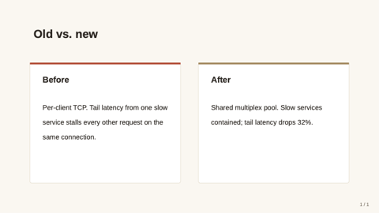

### hero-image-overlay
Full-bleed image with translucent overlay carrying title + subtitle.

- `image` — `image-ref`. Required.
- `title` — `text`, ≤ 60 chars. Required.
- `subtitle` — `text`, ≤ 100 chars. Optional.
- `align` — `text`. Optional.

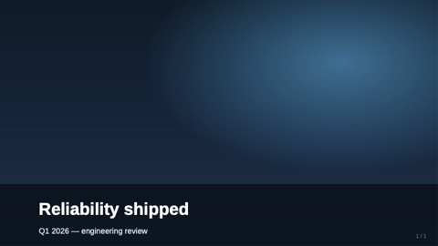

### data-table
Native table — header row + alternating row fills.

- `title` — `text`, ≤ 50 chars. Optional.
- `table` — `table`. Required.

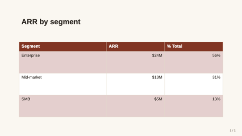

### quote
Pull-quote slide.

- `quote` — `text-block`, ≤ 240 chars. Required.
- `attribution` — `text`, ≤ 60 chars. Optional.

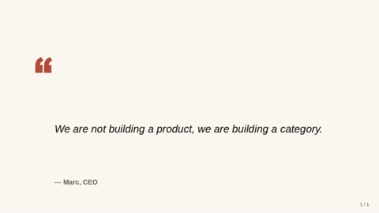

### code-block
Code snippet on a dark card.

- `title` — `text`, ≤ 50 chars. Optional.
- `language` — `text`, ≤ 16 chars. Optional.
- `code` — `text-block`, ≤ 1600 chars. Required.
- `caption` — `markdown-inline`, ≤ 160 chars. Optional.

> **Guidance:** Anti-pattern for an editorial theme — prefer `technical-blue` for code-heavy decks. Available for the rare exception (a memo that includes a single config snippet).

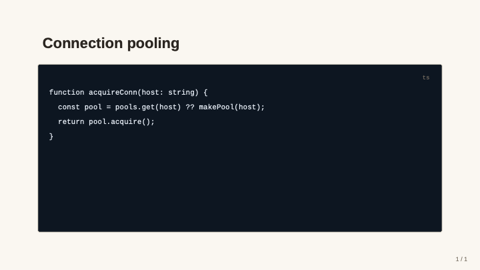

### dashboard
2×2 grid of polymorphic region cells.

- `title` — `text`, ≤ 50 chars. Optional.
- `tl`, `tr`, `bl`, `br` — `region`. Only `tl` required.

> **Guidance:** Anti-pattern for an editorial theme — dashboards belong in `technical-blue` / `midnight-executive`.

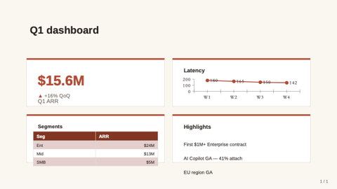
### timeline
Step or event sequence with a connecting rail and dots. Replaces the older timeline (horizontal step diagram) and timeline-text (vertical narrative timeline).

- `title` — `text`, ≤ 60 chars. Optional.
- `items` — `bullets`, 2-6 entries. Each `{ when?, title, description? }` (or a bare string treated as title). `when` renders in a left date column when direction=vertical.
- `direction` — enum `horizontal` (default — process diagram) | `vertical` (narrative timeline with optional date column).

### split
N polymorphic regions arranged in a row, column, or T-shape. Replaces split-2, split-3-horizontal, and split-3-vertical.

- `title` — `text`, ≤ 50 chars. Optional.
- `cell1`, `cell2` — `region`. Required.
- `cell3` — `region`. Optional (used when cells=3).
- `cells` — enum `2` | `3`. Default `2`.
- `direction` — enum `horizontal` (default) | `vertical` (only meaningful for cells=3 — produces T-shape: top row + 2-cell bottom).
- `ratio` — width/height ratio between cells. See enum values for direction-specific options.

### image-grid
Gallery of 2–4 images. Replaces image-pair and image-grid.

- `title` — `text`, ≤ 50 chars. Optional.
- `images` — `bullets`, 2-4 entries. Each `{ src, alt?, caption? }` or bare path string.
- count=2 (auto when 2 images supplied) renders side-by-side with optional uppercase label band above each image.
- count=4 renders 2×2 grid with each tile in a card and optional caption below.

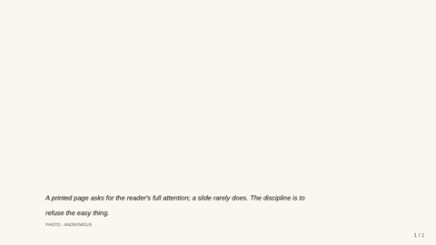

### funnel
Conversion / sales funnel — 3–6 stages narrowing top-down.

- `title` — `text`, ≤ 42 chars. Optional.
- `stages` — `bullets`, 3–6. Each `{ label, value?, sublabel? }`. Width tapers uniformly; value/sublabel render in right column.

### process-flow
Causal A→B→C pipeline rendered as connected chevrons. Use over `timeline` when conveying STAGES (no dates), over `key-point` when order matters.

- `title` — `text`, ≤ 42 chars. Optional.
- `steps` — `bullets`, 2–8. Each `{ title, description? }`.
- `direction` — `enum`: `horizontal` (default) | `vertical`. Optional.

### swot
Fixed Strengths / Weaknesses / Opportunities / Threats quadrants with canonical color semantics. Distinct from `matrix-2x2` (which is generic axis-labelled quadrants).

- `title` — `text`, ≤ 42 chars. Optional. Defaults to "SWOT 分析" / "SWOT Analysis".
- `strengths`, `weaknesses`, `opportunities`, `threats` — `bullets`, 1–6 each.

### content-grid
3–8 `{title, body}` cards in an auto-flex grid. Use over `key-point` (max 4) or `dashboard` (overkill for plain text) for the "I have N small content blocks" pattern.

- `title` — `text`, ≤ 42 chars. Optional.
- `items` — `bullets`, 3–8. Each `{ title, body? }`. Layout shape: 3→1×3, 4→2×2, 5–6→2×3, 7–8→2×4.

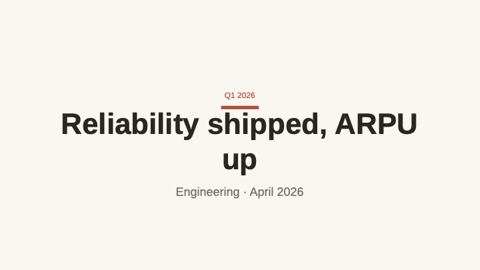

### roadmap
Gantt-style time × tracks. Periods axis (3–12 quarters/months) × tracks (1–7 work-stream lanes), each carrying phase bars that span one or more periods.

- `title` — `text`, ≤ 42 chars. Optional.
- `periods` — `bullets`, 3–12. Time bucket labels (`["Q1 2026", "Q2 2026", ...]`).
- `tracks` — `bullets`, 1–7. Each `{ name, bars: [{ start, end?, label?, status? }] }`. `start`/`end` are 0-based period indices. `status`: `planned|in-progress|done|at-risk|blocked` drives semantic color; otherwise track inherits a categorical color.

## Tokens

| Token | Value | Use |
|---|---|---|
| `font-latin` | Source Sans 3 → Source Sans Pro → Helvetica → Arial | Body sans (clean editorial weight) |
| `font-cjk` | Source Han Serif SC → PingFang SC → MS YaHei → Noto Sans CJK SC | Serif-leaning CJK to match the editorial tone — falls back gracefully to PingFang on macOS Office |
| `font-mono` | JetBrains Mono → Iosevka → Menlo → Consolas | Used only for code-block (rare in this theme) |
| `bg-canvas` | #FBF7F0 | Cream slide background |
| `bg-card` | #FFFFFF | Card backings |
| `brand-primary` | #C0432D | Rust accent — title rules, KPI value |
| `brand-deep` | #8C2E1B | Header bar / closing panel |
| `text-strong` | #2C2620 | Body and titles |
| `text-muted` | #7A6F62 | Captions and subtitles |
| `accent` | #A88859 | Secondary accent (gold) |
| `divider` | #E5DCC9 | Hairlines and card borders |
### funnel
Conversion / sales funnel — 3–6 stages narrowing top-down.

- `title` — `text`, ≤ 42 chars. Optional.
- `stages` — `bullets`, 3–6. Each `{ label, value?, sublabel? }`. Width tapers uniformly; value/sublabel render in right column.

### process-flow
Causal A→B→C pipeline rendered as connected chevrons. Use over `timeline` when conveying STAGES (no dates), over `key-point` when order matters.

- `title` — `text`, ≤ 42 chars. Optional.
- `steps` — `bullets`, 2–8. Each `{ title, description? }`.
- `direction` — `enum`: `horizontal` (default) | `vertical`. Optional.

### swot
Fixed Strengths / Weaknesses / Opportunities / Threats quadrants with canonical color semantics. Distinct from `matrix-2x2` (which is generic axis-labelled quadrants).

- `title` — `text`, ≤ 42 chars. Optional. Defaults to "SWOT 分析" / "SWOT Analysis".
- `strengths`, `weaknesses`, `opportunities`, `threats` — `bullets`, 1–6 each.

