# Forest & Moss

Sustainability / outdoor / wellness theme — cream canvas, deep forest text, moss accents. Restrained editorial style (no accent rules under titles).

## When to use this theme
- Sustainability, outdoor brands, wellness, environmental research.

## When NOT to use
- Tech-heavy or dense data decks (palette feels editorial, not analytical).

## How to pick a layout

A 7-line decision tree. Scan top-to-bottom; first match wins.

1. **Long text (>500 CJK / 800 latin chars)?** → `prose` or `two-column-prose`.
2. **Image is the point?** → `image-with-caption` (editorial) / `image-full-bleed` (cinematic) / `image-pair` (before/after).
3. **Image + supporting text?** → `two-col-text-image` / `image-split-text` (immersive). Pick `density` matching content length.
4. **Data?** → `chart-with-takeaway` (1 chart) / `data-table` (table) / `stat-grid-3` (3 KPIs) / `dashboard` (4 mixed).
5. **3-6 short points?** → `executive-summary` (with descriptions) / `bullet-with-image` / `key-point` (with icons).
6. **Side-by-side comparison?** → `compare-two-columns` / `split-2` (heterogeneous, with `ratio`).
7. **Nothing fits?** → `freeform` (last resort).

When text overflows the layout's density budget, the validator emits `DENSITY_OVERFLOW` with concrete next-step suggestions (try denser preset / switch to prose).

## Layout reference

### cover
Title slide. Pick for slide 1 only. Uses chrome `none` automatically.

- `title` — `text`, ≤ 60 chars. Required.
- `subtitle` — `text`, ≤ 80 chars. Optional.
- `eyebrow` — `text`, ≤ 32 chars. Optional. Small label above the title.

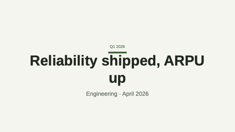

### agenda
Numbered list of upcoming sections (TOC).

- `title` — `text`, ≤ 30 chars. Optional.
- `items` — `bullets`, 2–8 items, ≤ 60 chars each.

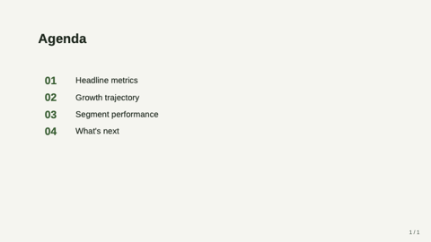

### stat-grid-3
Three KPI tiles in a row. Pick when surfacing 3 headline metrics.

- `title` — `text`, ≤ 40 chars.
- `items` — `bullets`, exactly 3, each `{ value, label, delta?, trend? }`.

> **Guidance:** Pick THE three most newsworthy numbers. Don't set every `trend` to `up`.

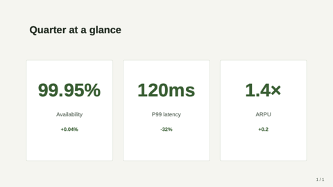

### image-with-takeaway
Title + STATIC image (rendered chart, diagram, photo) + boxed conclusion. The image-counterpart of `chart-with-takeaway` — use this when your chart is a PNG/JPG, NOT typed chart-spec data.

- `title` — `text`, ≤ 50 chars. Optional.
- `image` — `image-ref`. Required.
- `takeaway` — `markdown-inline`, ≤ 160 chars. Optional. Same callout panel as chart-with-takeaway.

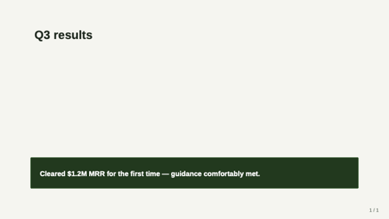

### chart-with-takeaway
Title + native data chart + boxed conclusion.

- `title` — `text`, ≤ 50 chars.
- `chart` — `chart-spec`.
- `takeaway` — `markdown-inline`, ≤ 160 chars. Optional.

> **Guidance:** The takeaway is a CONCLUSION (so-what), not a chart caption.

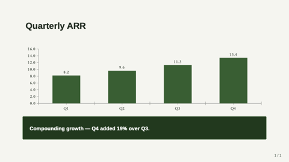

### bullet-with-image
Title + 3–6 bullets on the left, image on the right (optional).

- `title` — `text`, ≤ 50 chars.
- `bullets` — `bullets`, 3–6 items, ≤ 80 chars each.
- `image` — `image-ref`. Optional.

> **Guidance:** Bullets are TERSE — typically 5-12 words. Long prose belongs in `notes:`.

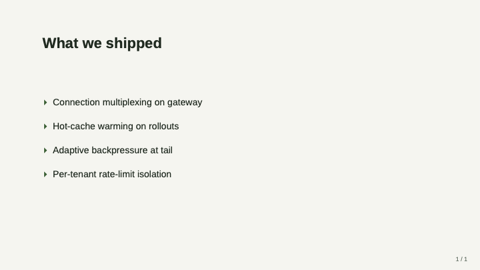

### closing
Mirror of `cover` — full-bleed deep panel. Use as the final "thank you" slide.

- `title` — `text`, ≤ 60 chars.
- `subtitle` — `text`, ≤ 80 chars. Optional.
- `image` — `image-ref`. Optional full-bleed background image; renders under a 75% brand-deep overlay.

### split-2
Title (optional) over two side-by-side cells; each cell is a polymorphic `region` (one of 8 kinds: kpi/chart/table/text/bullets/image/code/quote). Use for heterogeneous side-by-side content (bullets vs. chart, image vs. quote, code vs. explanation).

- `title` — `text`, ≤ 50 chars. Optional.
- `left`, `right` — `region` cells (required).

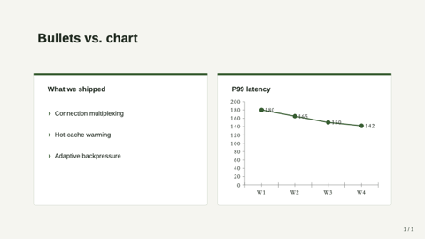

### split-3-horizontal
Title (optional) over three equal-width regions. Use for parallel comparison.

- `title` — `text`, ≤ 50 chars. Optional.
- `left`, `center`, `right` — `region` cells (required).

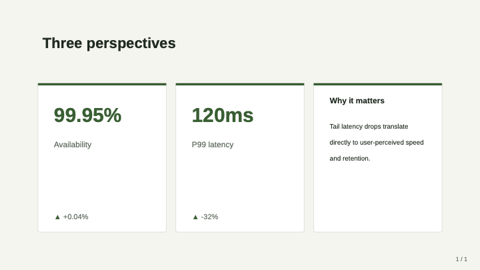

### split-3-vertical
Title (optional); full-width top region over a 50/50 bottom row. Use for "headline + supporting evidence".

- `title` — `text`, ≤ 50 chars. Optional.
- `top` — `region` (required, full width).
- `bl`, `br` — `region` cells (optional, bottom 50/50).

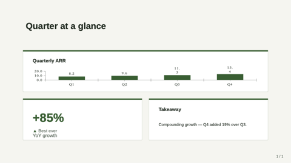

### hero-stat
One enormous headline number with a tagline.

- `value` — `text`, ≤ 20 chars. Required.
- `label` — `text`, ≤ 60 chars. Required.
- `caption` — `text-block`, ≤ 240 chars. Optional.
- `eyebrow` — `text`, ≤ 32 chars. Optional.

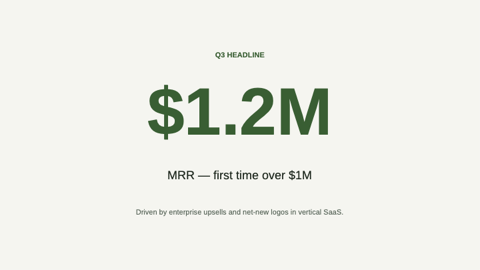

### matrix-2x2
Quadrant matrix with optional axis labels.

- `title` — `text`, ≤ 50 chars. Optional.
- `xLabel`, `yLabel` — `text`, ≤ 32 chars. Optional.
- `topLeft`, `topRight`, `botLeft`, `botRight` — `region` cells.

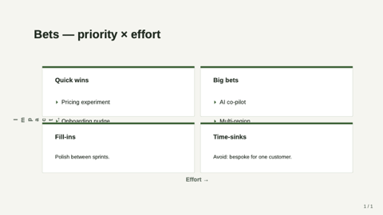

### team-grid
Photo grid of 2–8 team members.

- `title` — `text`, ≤ 50 chars. Optional.
- `members` — `bullets`, 2–8 entries. Each `{ name, role?, image?, bio? }`.

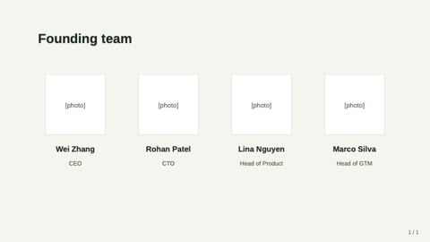

### image-full-bleed
Image fills the entire slide; optional `caption` band.

- `image` — `image-ref`. Required.
- `caption` — `text`, ≤ 120 chars. Optional.

### image-with-caption
Image with italic caption + optional credit.

- `image` — `image-ref`. Required.
- `caption` — `text-block`, ≤ 320 chars. Required.
- `credit` — `text`, ≤ 80 chars. Optional.

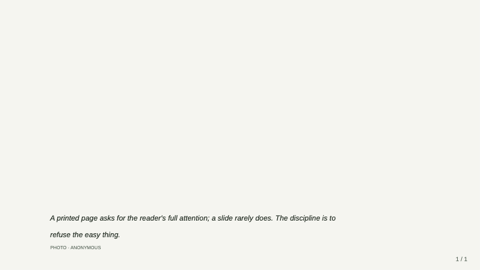

### image-pair
Two side-by-side images for before/after.

- `title` — `text`, ≤ 50 chars. Optional.
- `leftImage`, `rightImage` — `image-ref`. Required.
- `leftLabel`, `rightLabel` — `text`, ≤ 32 chars. Optional.

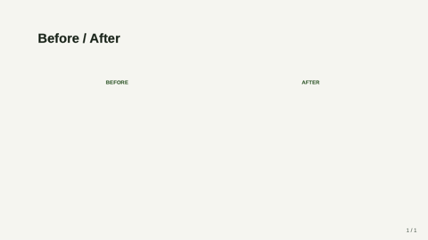

### image-split-text
Immersive 50/50 split — full-bleed image vs text.

- `title` — `text`, ≤ 60 chars. Required.
- `text` — `text-block`, ≤ 480 chars. Required.
- `image` — `image-ref`. Required.
- `imageSide` — `text` (left|right). Optional.

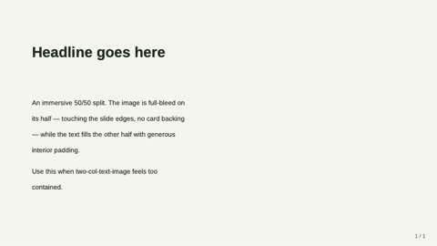

### pricing-table
2–4 pricing tiers. `{ name, price, period?, features?, recommended? }`.

- `title` — `text`, ≤ 50 chars. Optional.
- `tiers` — `bullets`, 2–4 entries.

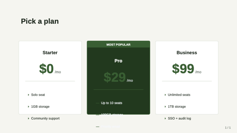

### quote-with-portrait
Pull-quote with circular portrait.

- `quote` — `text-block`, ≤ 280 chars. Required.
- `name` — `text`, ≤ 60 chars. Required.
- `role` — `text`, ≤ 80 chars. Optional.
- `portrait` — `image-ref`. Optional.

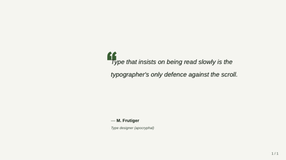

### key-point
Headline + 2–4 supporting points with icons.

- `headline` — `text`, ≤ 80 chars. Required.
- `points` — `bullets`, 2–4 entries. Each `{ icon?, title, description? }`.

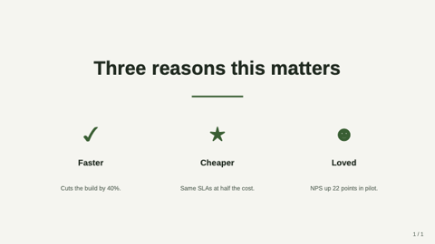

### freeform
Escape-hatch — `shapes: [{ kind, x, y, w, h, ... }]`.

- `title` — `text`, ≤ 80 chars. Optional.
- `shapes` — `bullets`, 1–40 entries.

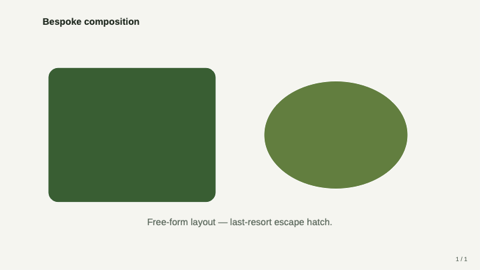

### prose
Single-column long-form text.

- `title` — `text`, ≤ 80. Optional.
- `subtitle` — `text`, ≤ 120. Optional.
- `body` — `text-block`, ≤ 1600. Required.

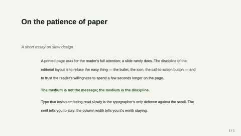

### two-column-prose
Long body flowed across two columns.

- `title` — `text`, ≤ 80. Optional.
- `subtitle` — `text`, ≤ 120. Optional.
- `body` — `text-block`, ≤ 2400. Required.

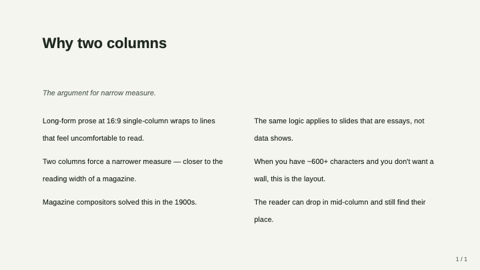

### executive-summary
Numbered TL;DR clipboard.

- `title` — `text`, ≤ 60. Optional.
- `items` — `bullets`, 2–6 entries. Each `{ heading, line? }`.

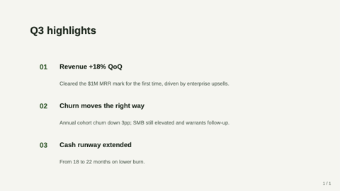

### q-and-a
FAQ list — 1–5 question + answer pairs.

- `title` — `text`, ≤ 60. Optional.
- `items` — `bullets`, 1–5 entries. Each `{ q, a? }`.

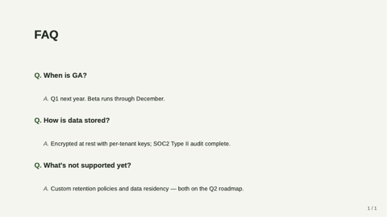

### definition
Single-term dictionary page.

- `term` — `text`, ≤ 40. Required.
- `pronounce`, `partOfSpeech` — `text`. Optional.
- `body` — `text-block`, ≤ 600. Required.
- `example` — `text-block`, ≤ 240. Optional.

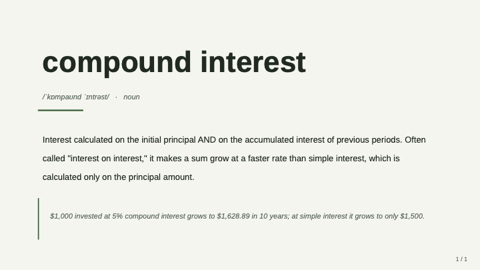

### outline
Multi-level table of contents.

- `title` — `text`, ≤ 60. Optional.
- `items` — `bullets`, 2–8. Each `string` or `{ text, sub: [string] }`.

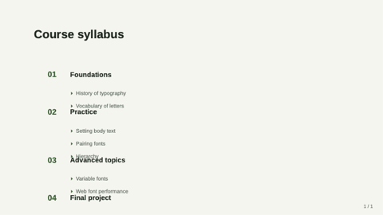

### timeline-text
Vertical narrative timeline.

- `title` — `text`, ≤ 60. Optional.
- `events` — `bullets`, 2–6 entries. Each `{ when, title, body? }`.

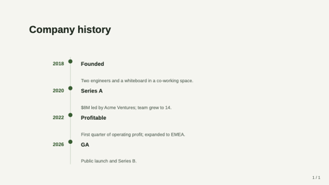

### letter
Letter format with date + recipient + body + signature.

- `date`, `recipient`, `signoff`, `signRole` — `text`. Optional.
- `body` — `text-block`, ≤ 1400. Required.
- `signature` — `text`, ≤ 60. Required.

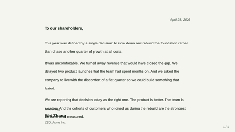

### glossary
Two-column term + definition list.

- `title` — `text`, ≤ 60. Optional.
- `terms` — `bullets`, 3–12 entries.

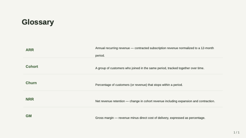

### framed
Five-region layout with optional edge bands.

- `title` — `text`, ≤ 50 chars. Optional.
- `header`, `footer`, `leftEdge`, `rightEdge` — `region`. Optional.
- `center` — `region`. Required.

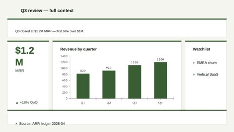

### title-only
Single centered title.

- `title` — `text`, ≤ 80 chars. Required.

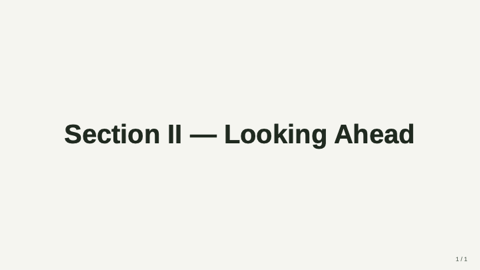

### section-divider
Section break with optional eyebrow.

- `eyebrow` — `text`, ≤ 32. Optional.
- `title` — `text`, ≤ 50. Required.

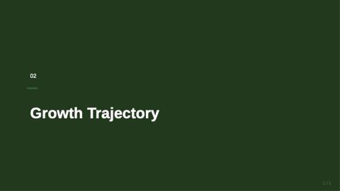

### two-col-text-image
Title + text on one side, image on the other.

- `title` — `text`, ≤ 50. Required.
- `text` — `text-block`, ≤ 400. Required.
- `image` — `image-ref`. Required.
- `imageSide` — `text` (left|right). Optional.

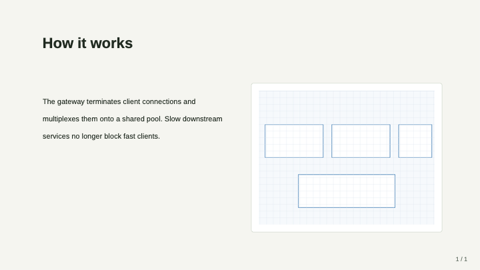

### compare-two-columns
Side-by-side option A vs option B.

- `title` — `text`, ≤ 50. Optional.
- `leftTitle`, `leftBody`, `rightTitle`, `rightBody` — required.

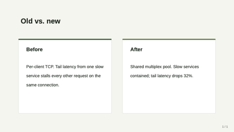

### process-timeline
3–5 steps along a horizontal rail.

- `title` — `text`, ≤ 50. Required.
- `steps` — `bullets`, 3–5 entries.

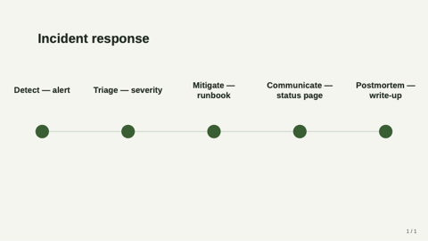

### image-grid-2x2
Up to 4 images in a 2×2 grid.

- `title` — `text`, ≤ 50. Optional.
- `images` — `bullets`, 2–4 entries.

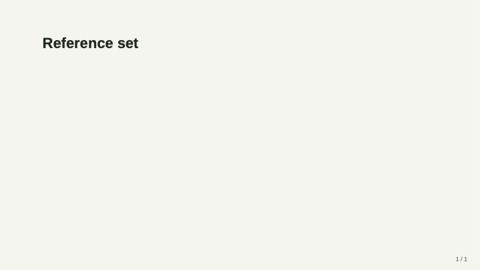

### hero-image-overlay
Full-bleed image with overlay carrying title + subtitle.

- `image` — `image-ref`. Required.
- `title` — `text`, ≤ 60. Required.
- `subtitle` — `text`, ≤ 100. Optional.
- `align` — `text`. Optional.

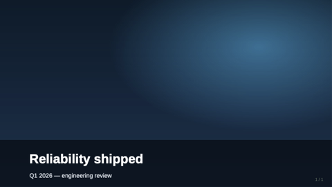

### data-table
Native table with header row + alternating rows.

- `title` — `text`, ≤ 50. Optional.
- `table` — `table`. Required.

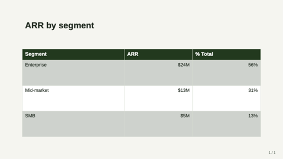

### quote
Pull-quote slide.

- `quote` — `text-block`, ≤ 240. Required.
- `attribution` — `text`, ≤ 60. Optional.

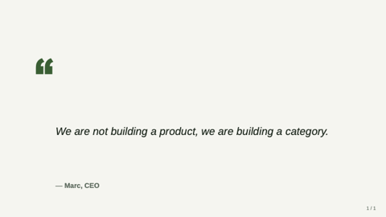

### code-block
Code snippet on a dark card.

- `title`, `language` — `text`. Optional.
- `code` — `text-block`, ≤ 1600. Required.
- `caption` — `markdown-inline`, ≤ 160. Optional.

> **Guidance:** Anti-pattern for forest-moss — prefer `technical-blue` for code-heavy decks.

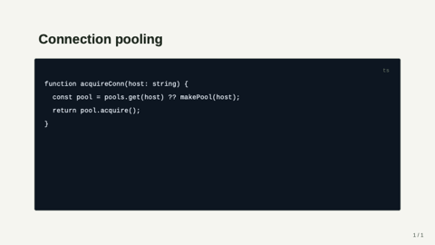

### dashboard
2×2 grid of region cells.

- `title` — `text`, ≤ 50. Optional.
- `tl`, `tr`, `bl`, `br` — `region`. Only `tl` required.

> **Guidance:** Anti-pattern for forest-moss — dashboards clash with the calm style.

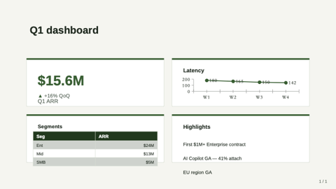

## Tokens

| Token | Value |
|---|---|
| `bg-canvas` | #F5F5F0 cream |
| `bg-card` | #FFFFFF white |
| `text-strong` | #1E2A1F deep forest |
| `text-muted` | #5A6B5D warm gray-green |
| `brand-primary` | #2C5F2D forest |
| `brand-deep` | #1A3A1B very-deep forest |
| `accent` | #97BC62 moss |
| `font-latin` | Source Sans 3 → Source Sans Pro → Avenir Next → Helvetica → Arial | Soft humanist sans; pairs with the cream canvas |
| `font-cjk`   | Source Han Sans CN → PingFang SC → Noto Sans CJK SC → MS YaHei | Source Han first — its rounded forms match the warm aesthetic better than PingFang's sharper terminals |
| `font-mono`  | JetBrains Mono → Menlo → Consolas | Cross-platform monospace |
