# Midnight Executive

Premium executive theme — deep navy canvas with ice-blue muted text and an amber accent. Reads like a board pack.

## When to use this theme
- Board updates, executive summaries, premium investor pitches.

## When NOT to use
- Casual / consumer / sustainability decks.

## How to pick a layout

A 7-line decision tree. Scan top-to-bottom; first match wins.

1. **Long text (>500 CJK / 800 latin chars)?** → `prose` or `two-column-prose`.
2. **Image is the point?** → `visual-with-caption` (editorial) / `image-full-bleed` (cinematic) / `image-pair` (before/after).
3. **Image + supporting text?** → `visual-with-text` (visual + sibling text column; imageStyle: card or bleed). Pick `density` matching content length.
4. **Data?** → `chart-with-takeaway` (1 chart) / `data-table` (table) / `stat-grid-3` (3 KPIs) / `dashboard` (4 mixed).
5. **3-6 short points?** → `executive-summary` (with descriptions) / `visual-with-text` (textKind: bullets) / `key-point` (with icons).
6. **Side-by-side comparison?** → `compare-two-columns` / `split-2` (heterogeneous, with `ratio`).
7. **Nothing fits?** → `freeform` (last resort).

When text overflows the layout's density budget, the validator emits `DENSITY_OVERFLOW` with concrete next-step suggestions (try denser preset / switch to prose).

## Layout reference

### cover
Title slide. Pick for slide 1 only. Uses chrome `none` automatically.

- `title` — `text`, ≤ 60 chars. Required.
- `subtitle` — `text`, ≤ 80 chars. Optional.
- `eyebrow` — `text`, ≤ 32 chars. Optional. Small label above the title.

### agenda
Numbered list of upcoming sections (TOC).

- `title` — `text`, ≤ 30 chars. Optional.
- `items` — `bullets`, 2–8 items, ≤ 60 chars each.

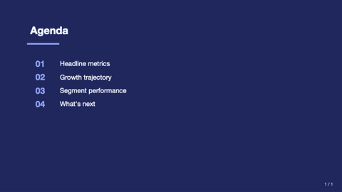

### stat-grid-3
Three KPI tiles in a row. Pick when surfacing 3 headline metrics.

- `title` — `text`, ≤ 40 chars.
- `items` — `bullets`, exactly 3, each `{ value, label, delta?, trend? }`.

> **Guidance:** Pick THE three most newsworthy numbers. Don't set every `trend` to `up`.

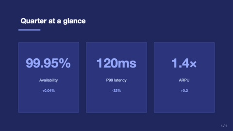

### closing
Mirror of `cover` — full-bleed deep panel. Use as the final "thank you" slide.

- `title` — `text`, ≤ 60 chars.
- `subtitle` — `text`, ≤ 80 chars. Optional.
- `image` — `image-ref`. Optional full-bleed background image; renders under a 75% brand-deep overlay.

### hero-stat
One enormous headline number with a tagline. Drives the deck's headline insight.

- `value` — `text`, ≤ 20 chars. Required.
- `label` — `text`, ≤ 60 chars. Required.
- `caption` — `text-block`, ≤ 240 chars. Optional.
- `eyebrow` — `text`, ≤ 32 chars. Optional.

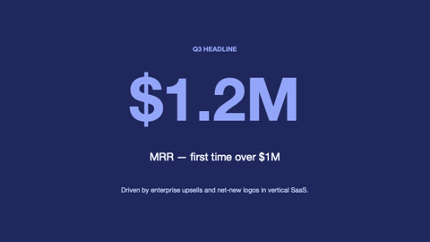

### matrix-2x2
Quadrant matrix with optional axis labels — each quadrant is a `region` cell.

- `title` — `text`, ≤ 50 chars. Optional.
- `xLabel`, `yLabel` — `text`, ≤ 32 chars. Optional.
- `topLeft`, `topRight`, `botLeft`, `botRight` — `region` cells.

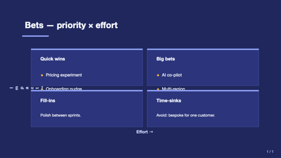

### team-grid
Board / leadership grid — 2–8 members with circular avatars + name + role.

- `title` — `text`, ≤ 50 chars. Optional.
- `members` — `bullets`, 2–8 entries. Each `{ name, role?, image?, bio? }`.

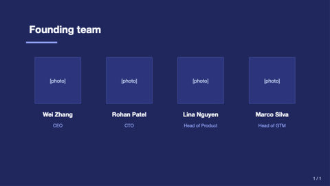

### image-full-bleed
Image fills the entire slide; optional `caption` band.

- `image` — `image-ref`. Required.
- `caption` — `text`, ≤ 120 chars. Optional.

### visual-with-caption
Image + italic caption + optional credit. Editorial feel.

- `image` — `image-ref`. Required.
- `caption` — `text-block`, ≤ 320 chars. Required.
- `credit` — `text`, ≤ 80 chars. Optional.

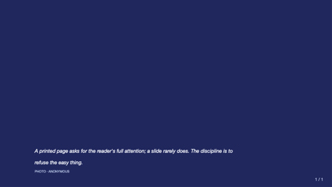

### visual-with-text
Visual + sibling text column. Replaces the older two-col-text-image / image-split-text / bullet-with-image. Pick `textKind` (prose or bullets) and `imageStyle` (card or bleed, image only).

- `title` — `text`, ≤ 60 chars. Optional.
- `visual` — `visual` ({ kind: "image" | "chart" | "table" | "svg", ... }). Optional (no visual → text fills slide).
- `textKind` — enum `prose` | `bullets`. Default `prose`.
- `text` — `text-block`, ≤ 1500 chars. Required when textKind=prose.
- `bullets` — `bullets`, 2-7 items × 140 chars. Required when textKind=bullets.
- `position` — enum `left` | `right`. Visual side. Default `right`.
- `imageStyle` — enum `card` | `bleed`. Image-only; chart/table/svg ignore it. Default `card`.
- `ratio` — text:visual width. Default `50-50`.
- `density` — `loose | normal | dense | micro`. Prose body density.

### pricing-table
2–4 pricing tiers.

- `title` — `text`, ≤ 50 chars. Optional.
- `tiers` — `bullets`, 2–4 entries. `{ name, price, period?, features?, recommended? }`.

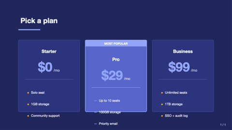

### key-point
Headline + 2–4 supporting points with icons.

- `headline` — `text`, ≤ 80 chars. Required.
- `points` — `bullets`, 2–4 entries. Each `{ icon?, title, description? }`.

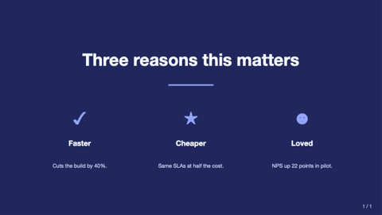

### freeform
Escape-hatch — `shapes: [{ kind, x, y, w, h, ... }]`.

- `title` — `text`, ≤ 80 chars. Optional.
- `shapes` — `bullets`, 1–40 entries.

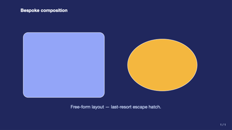

### prose
Single-column long-form text — board minutes, memos.

- `title` — `text`, ≤ 80. Optional.
- `subtitle` — `text`, ≤ 120. Optional.
- `body` — `text-block`, ≤ 1600. Required.

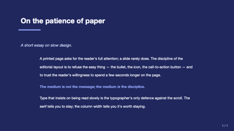

### executive-summary
Numbered TL;DR clipboard for board front-pages.

- `title` — `text`, ≤ 60. Optional.
- `items` — `bullets`, 2–6 entries. Each `{ heading, line? }`.

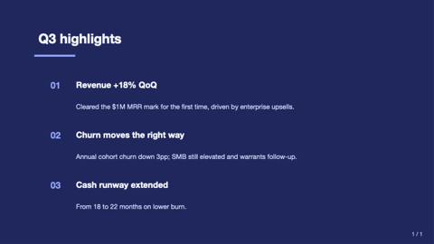

### q-and-a
1–5 question + answer pairs.

- `title` — `text`, ≤ 60. Optional.
- `items` — `bullets`, 1–5 entries. Each `{ q, a? }`.

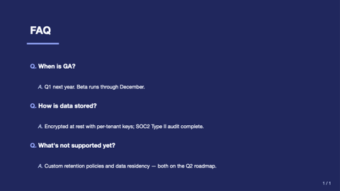

### definition
Single-term page — terminology slide.

- `term` — `text`, ≤ 40. Required.
- `pronounce`, `partOfSpeech` — `text`. Optional.
- `body` — `text-block`, ≤ 600. Required.
- `example` — `text-block`, ≤ 240. Optional.

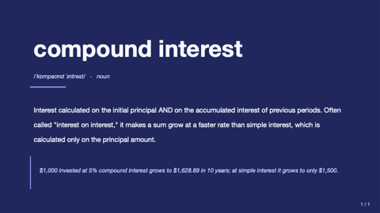

### outline
Multi-level table of contents.

- `title` — `text`, ≤ 60. Optional.
- `items` — `bullets`, 2–8 entries.

### letter
Open-letter format — CEO letter to shareholders, formal communications.

- `date`, `recipient`, `signoff`, `signRole` — `text`. Optional.
- `body` — `text-block`, ≤ 1400. Required.
- `signature` — `text`, ≤ 60. Required.

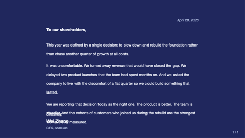

### glossary
Two-column term + definition list.

- `title` — `text`, ≤ 60. Optional.
- `terms` — `bullets`, 3–12 entries.

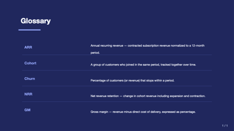

### framed
Five-region layout — header / footer / left / right edges plus a center.
Use for executive context strips, persistent legends, or compliance footnotes.

- `title` — `text`, ≤ 50 chars. Optional.
- `header`, `footer`, `leftEdge`, `rightEdge` — `region`. Optional bands.
- `center` — `region`. Required.

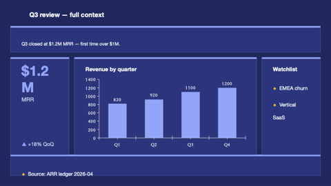

### title-only
Single centered title for chapter / section pause.

- `title` — `text`, ≤ 80. Required.

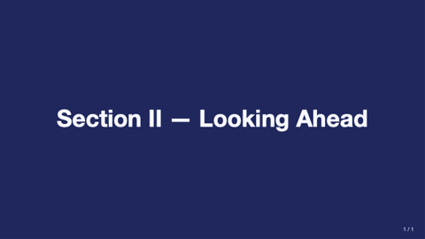

### section-divider
Section break with eyebrow.

- `eyebrow` — `text`, ≤ 32. Optional.
- `title` — `text`, ≤ 50. Required.

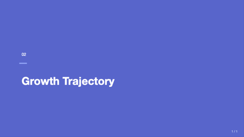

### compare-two-columns
Side-by-side option A vs option B.

- `title` — `text`, ≤ 50. Optional.
- `leftTitle`, `leftBody`, `rightTitle`, `rightBody` — required.

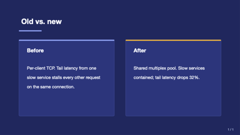

### hero-image-overlay
Full-bleed image with overlay carrying title + subtitle. Boardroom-friendly.

- `image` — `image-ref`. Required.
- `title` — `text`, ≤ 60. Required.
- `subtitle` — `text`, ≤ 100. Optional.
- `align` — `text`. Optional.

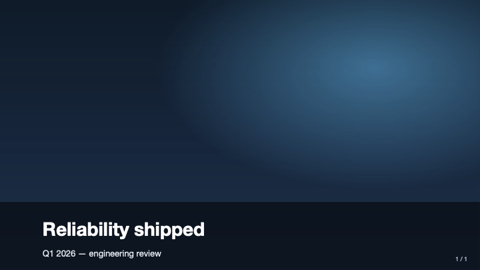

### data-table
Native table — perfect for board financial summaries.

- `title` — `text`, ≤ 50. Optional.
- `table` — `table`. Required.

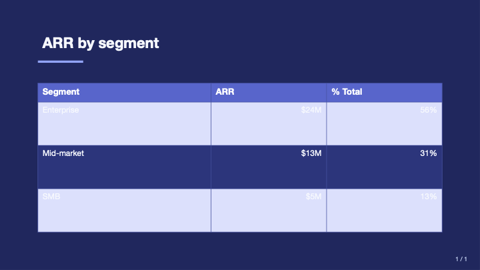

### quote
Pull-quote slide.

- `quote` — `text-block`, ≤ 240. Required.
- `attribution` — `text`, ≤ 60. Optional.

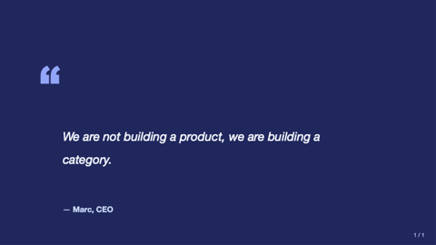

### code-block
Code snippet on a dark card.

- `title`, `language` — `text`. Optional.
- `code` — `text-block`, ≤ 1600. Required.
- `caption` — `markdown-inline`, ≤ 160. Optional.

> **Guidance:** Use sparingly for executive decks — board members rarely need raw code.

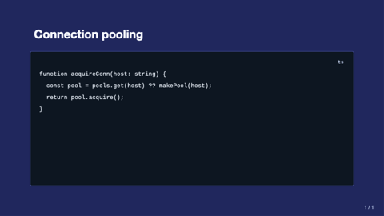

### dashboard
2×2 grid of region cells. The signature executive briefing layout.

- `title` — `text`, ≤ 50. Optional.
- `tl`, `tr`, `bl`, `br` — `region`. Only `tl` required.

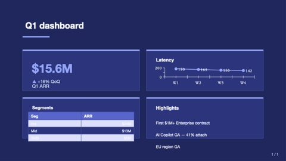
### timeline
Step or event sequence with a connecting rail and dots. Replaces the older timeline (horizontal step diagram) and timeline-text (vertical narrative timeline).

- `title` — `text`, ≤ 60 chars. Optional.
- `items` — `bullets`, 2-6 entries. Each `{ when?, title, description? }` (or a bare string treated as title). `when` renders in a left date column when direction=vertical.
- `direction` — enum `horizontal` (default — process diagram) | `vertical` (narrative timeline with optional date column).

### split
N polymorphic regions arranged in a row, column, or T-shape. Replaces split-2, split-3-horizontal, and split-3-vertical.

- `title` — `text`, ≤ 50 chars. Optional.
- `cell1`, `cell2` — `region`. Required.
- `cell3` — `region`. Optional (used when cells=3).
- `cells` — enum `2` | `3`. Default `2`.
- `direction` — enum `horizontal` (default) | `vertical` (only meaningful for cells=3 — produces T-shape: top row + 2-cell bottom).
- `ratio` — width/height ratio between cells. See enum values for direction-specific options.

### image-grid
Gallery of 2–4 images. Replaces image-pair and image-grid.

- `title` — `text`, ≤ 50 chars. Optional.
- `images` — `bullets`, 2-4 entries. Each `{ src, alt?, caption? }` or bare path string.
- count=2 (auto when 2 images supplied) renders side-by-side with optional uppercase label band above each image.
- count=4 renders 2×2 grid with each tile in a card and optional caption below.

### funnel
Conversion / sales funnel — 3–6 stages narrowing top-down.

- `title` — `text`, ≤ 42 chars. Optional.
- `stages` — `bullets`, 3–6. Each `{ label, value?, sublabel? }`. Width tapers uniformly; value/sublabel render in right column.

### process-flow
Causal A→B→C pipeline rendered as connected chevrons. Use over `timeline` when conveying STAGES (no dates), over `key-point` when order matters.

- `title` — `text`, ≤ 42 chars. Optional.
- `steps` — `bullets`, 2–8. Each `{ title, description? }`.
- `direction` — `enum`: `horizontal` (default) | `vertical`. Optional.

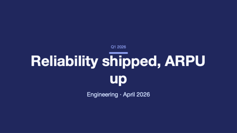

### swot
Fixed Strengths / Weaknesses / Opportunities / Threats quadrants with canonical color semantics. Distinct from `matrix-2x2` (which is generic axis-labelled quadrants).

- `title` — `text`, ≤ 42 chars. Optional. Defaults to "SWOT 分析" / "SWOT Analysis".
- `strengths`, `weaknesses`, `opportunities`, `threats` — `bullets`, 1–6 each.

### content-grid
3–8 `{title, body}` cards in an auto-flex grid. Use over `key-point` (max 4) or `dashboard` (overkill for plain text) for the "I have N small content blocks" pattern.

- `title` — `text`, ≤ 42 chars. Optional.
- `items` — `bullets`, 3–8. Each `{ title, body? }`. Layout shape: 3→1×3, 4→2×2, 5–6→2×3, 7–8→2×4.

### roadmap
Gantt-style time × tracks. Periods axis (3–12 quarters/months) × tracks (1–7 work-stream lanes), each carrying phase bars that span one or more periods.

- `title` — `text`, ≤ 42 chars. Optional.
- `periods` — `bullets`, 3–12. Time bucket labels (`["Q1 2026", "Q2 2026", ...]`).
- `tracks` — `bullets`, 1–7. Each `{ name, bars: [{ start, end?, label?, status? }] }`. `start`/`end` are 0-based period indices. `status`: `planned|in-progress|done|at-risk|blocked` drives semantic color; otherwise track inherits a categorical color.

## Tokens

| Token | Value |
|---|---|
| `bg-canvas` | #1E2761 deep navy |
| `bg-card` | #2A3580 raised |
| `text-strong` | #F5F8FF near-white |
| `text-muted` | #CADCFC ice blue |
| `brand-primary` | #8FA6FF periwinkle |
| `brand-deep` | #0F1340 midnight |
| `accent` | #FFB400 amber |
| `font-latin` | Helvetica Neue → Inter → Avenir Next → Arial | Boardroom-classic Helvetica first; Inter as the modern fallback when Helvetica is licensed-out |
| `font-cjk`   | PingFang SC → Source Han Sans CN → MS YaHei → Noto Sans CJK SC | macOS-first; Windows Office picks YaHei; Linux/cross-platform falls to Noto |
| `font-mono`  | SF Mono → JetBrains Mono → Menlo → Consolas | macOS-first ordering for executive viewing on Mac |
### funnel
Conversion / sales funnel — 3–6 stages narrowing top-down.

- `title` — `text`, ≤ 42 chars. Optional.
- `stages` — `bullets`, 3–6. Each `{ label, value?, sublabel? }`. Width tapers uniformly; value/sublabel render in right column.

### process-flow
Causal A→B→C pipeline rendered as connected chevrons. Use over `timeline` when conveying STAGES (no dates), over `key-point` when order matters.

- `title` — `text`, ≤ 42 chars. Optional.
- `steps` — `bullets`, 2–8. Each `{ title, description? }`.
- `direction` — `enum`: `horizontal` (default) | `vertical`. Optional.

### swot
Fixed Strengths / Weaknesses / Opportunities / Threats quadrants with canonical color semantics. Distinct from `matrix-2x2` (which is generic axis-labelled quadrants).

- `title` — `text`, ≤ 42 chars. Optional. Defaults to "SWOT 分析" / "SWOT Analysis".
- `strengths`, `weaknesses`, `opportunities`, `threats` — `bullets`, 1–6 each.

