# Technical Blue

A clean engineering / data-presentation theme. Deep navy canvas, cyan
accents, high information density. Designed for technical reports,
post-mortems, market analyses, and quarterly reviews.

## When to use this theme
- Engineering reviews, architecture proposals, post-mortems.
- Quarterly business reviews and market analyses with charts and KPIs.
- Audiences expecting precision over polish.

## When NOT to use
- Sales / marketing decks (warmer palette would land better).
- Investor pitches (less density, more whitespace).
- Print-oriented documents.

## Layout reference

### cover
Title slide. Pick for slide 1 only. Uses chrome `none` automatically.

- `title` — `text`, ≤ 60 chars. Required.
- `subtitle` — `text`, ≤ 80 chars. Optional.
- `eyebrow` — `text`, ≤ 20 chars. Optional. Small label above the title (e.g. "2026 Q1 Review").

### section-divider
Section break between major parts of the deck.

- `eyebrow` — `text`, ≤ 20 chars. Optional. Small label above the title (e.g. "第二部分").
- `title` — `text`, ≤ 50 chars. Required. The section name.

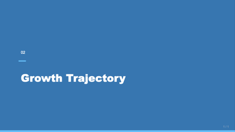

### stat-grid-3
Three KPI tiles in a row. Pick when surfacing 3 headline metrics.

- `title` — `text`, ≤ 40 chars. Required.
- `items` — `bullets`, exactly 3 entries. Each entry is a KPI object:
  `{ value: text(8), label: text(20), delta: text(10), trend: up|down|flat }`.

> **Guidance:** Pick THE three most newsworthy numbers — not whatever you have data for. If only two KPIs are genuinely material, use a different layout. Don't set every `trend` to `up`; that loses signal. `value` is the headline (e.g. "$42.5M"), `label` names the metric, `delta` shows the comparison ("+85% YoY", not "85").

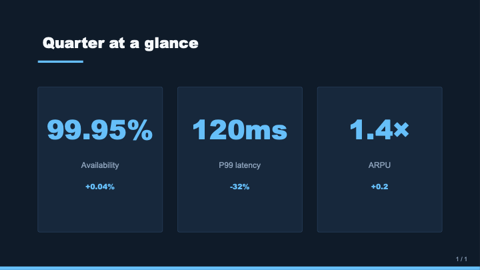

### bullet-with-image
Title + 3-6 bullets on the left, image on the right.

- `title` — `text`, ≤ 50 chars. Required.
- `bullets` — `bullets`, 3-6 entries, each ≤ 80 chars. Required.
- `image` — `image-ref`. Optional — when omitted, bullets expand to full width.

> **Guidance:** Bullets are TERSE — typically 5-12 words, never full sentences with em-dashes. Long prose belongs in `notes:`. If you don't have a real image, omit `image` (don't fabricate URLs).

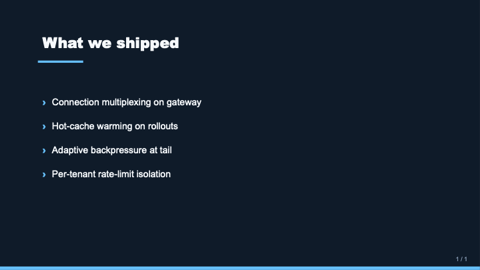

### two-col-text-image
Symmetric two-column layout with paragraph text on one side and an image
on the other. Use for "headline + visual" slides.

- `title` — `text`, ≤ 50 chars. Required.
- `text` — `text-block`, ≤ 400 chars. Required.
- `image` — `image-ref`. Required.
- `imageSide` — `text` (`left` or `right`). Optional, default `right`.

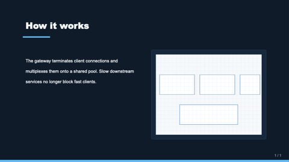

### quote
Pull-quote slide. Use for testimonials, key insights, or punctuation slides.

- `quote` — `text-block`, ≤ 240 chars. Required.
- `attribution` — `text`, ≤ 60 chars. Optional. Speaker / source.

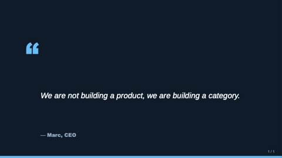

### chart-with-takeaway
Title + native data chart + boxed conclusion. Pick when the slide's job is
to show one chart and one takeaway sentence.

- `title` — `text`, ≤ 50 chars. Required.
- `chart` — `chart-spec`. Required. `{ type: bar|stacked-bar|line|area|pie|doughnut, data: { labels, series }, format: { y: int|decimal|percent|wanyuan|yi }, title? }`.
- `takeaway` — `markdown-inline`, ≤ 160 chars. Optional. Rendered in a callout below the chart.

> **Guidance:** The `takeaway` is a CONCLUSION (so-what), not a chart caption. Bad: "Chart shows quarterly revenue". Good: "**Q4 grew 19% QoQ** — second-half acceleration is real, not a base-effect." Pick chart `type` by intent: bar = compare across categories; line = change over time; stacked-bar = composition over time; pie = part-of-whole when ≤4 slices.

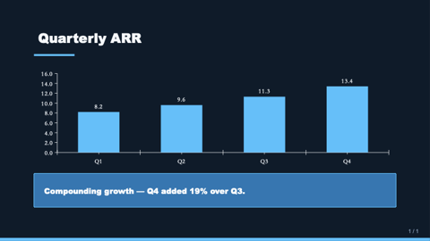

### title-only
Single centered title — use as a section transition or chapter break.

- `title` — `text`, ≤ 80 chars. Required.

### agenda
Numbered list of upcoming sections (TOC).

- `title` — `text`, ≤ 30 chars. Optional. Defaults to "目录" / "Agenda".
- `items` — `bullets`, 2–8 entries, each ≤ 60 chars. Required.

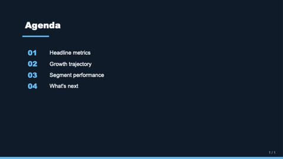

### compare-two-columns
Side-by-side option A / option B card layout.

- `title` — `text`, ≤ 50 chars. Optional.
- `leftTitle` — `text`, ≤ 30 chars. Required.
- `leftBody` — `text-block`, ≤ 280 chars. Required.
- `rightTitle` — `text`, ≤ 30 chars. Required.
- `rightBody` — `text-block`, ≤ 280 chars. Required.

### process-timeline
3–5 steps along a horizontal rail with cyan dots.

- `title` — `text`, ≤ 50 chars. Required.
- `steps` — `bullets`, 3–5 entries. Each may be a string or an object `{ title, description? }`.

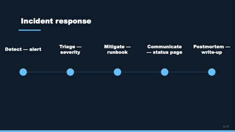

### image-grid-2x2
Up to 4 images in a 2×2 grid with optional captions.

- `title` — `text`, ≤ 50 chars. Optional.
- `images` — `bullets`, 2–4 entries. Each entry is `{ src, alt?, caption? }`.

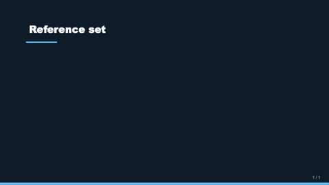

### hero-image-overlay
Full-bleed image with a translucent overlay carrying a title and subtitle.

- `image` — `image-ref`. Required.
- `title` — `text`, ≤ 60 chars. Required.
- `subtitle` — `text`, ≤ 100 chars. Optional.
- `align` — `text` (`bottom-left` | `bottom-right` | `bottom-center` | `top-left` | etc.). Optional, default `bottom-left`.

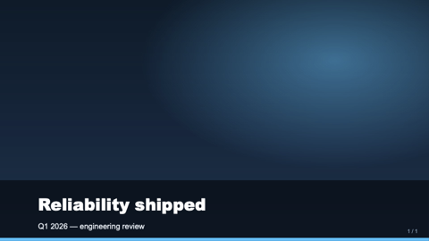

### data-table
Native OOXML table with a header row, alternating row fills, and clean borders.

- `title` — `text`, ≤ 50 chars. Optional.
- `table` — `table`. Required: `{ header: string[], rows: string[][], colWidths?: number[] }`. `colWidths` are relative weights (1–N).

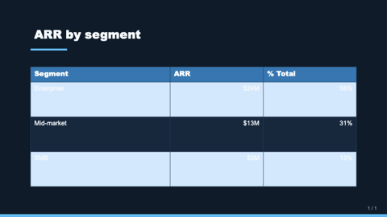

### code-block
Code snippet on a dark card with monospace text and an optional language badge.

- `title` — `text`, ≤ 50 chars. Optional.
- `language` — `text`, ≤ 16 chars. Optional. Shown as a small badge top-right of the card (e.g. `typescript`, `python`).
- `code` — `text-block`, ≤ 1600 chars. Required. Newlines preserved as line breaks.
- `caption` — `markdown-inline`, ≤ 160 chars. Optional. Italic line below the card.

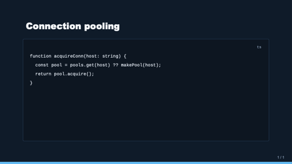

### closing
Mirror of `cover` — full-bleed deep-blue panel with a centered title and optional subtitle. Use as the final "thank you" slide.

- `title` — `text`, ≤ 60 chars. Required.
- `subtitle` — `text`, ≤ 80 chars. Optional.

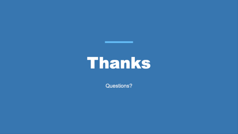

### dashboard
2×2 grid where each cell hosts a polymorphic region. Use when one slide
must surface multiple kinds of content at once (KPI + chart + table + text).

- `title` — `text`, ≤ 50 chars. Optional.
- `tl` / `tr` / `bl` / `br` — `region` cells. Each cell is one of:
  - `{ kind: "kpi", value, label, delta?, trend? }`
  - `{ kind: "chart", chart: { type, data, format? }, title? }`
  - `{ kind: "table", table: { header, rows, colWidths? }, title? }`
  - `{ kind: "text", body, title? }`
- Only `tl` is required; remaining cells render empty when omitted.

> **Guidance:** Use this ONLY when the slide truly needs heterogeneous content together (executive briefing). For a single chart, single table, or single KPI grid prefer the focused layout (chart-with-takeaway / data-table / stat-grid-3) — they look better. Mix kinds across cells: don't put 4 KPIs here, use stat-grid-3.

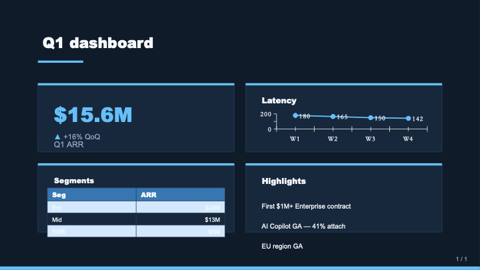

### split-2
Optional title above two side-by-side cells. Each cell hosts a polymorphic
region (one of 8 kinds: kpi / chart / table / text / bullets / image / code / quote).
Use for "bullets vs. chart", "image vs. quote", "code vs. explanation".

- `title` — `text`, ≤ 50 chars. Optional.
- `left`, `right` — `region` cells (both required).

> **Guidance:** Use only when the slide truly needs HETEROGENEOUS content side-by-side. For two pieces of the same kind (two text blocks, two charts), use the focused layout. Mixing kinds is the whole point.

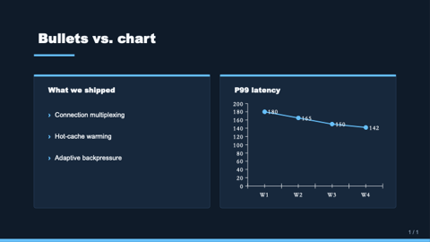

### split-3-horizontal
Optional title over three equal columns. Each column is a `region`.
Use for parallel comparison of three items (three options, three KPIs
expressed as different cell kinds, three image+caption tiles).

- `title` — `text`, ≤ 50 chars. Optional.
- `left`, `center`, `right` — `region` cells (all required).

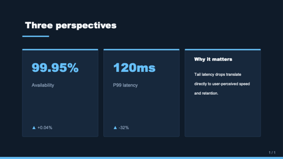

### split-3-vertical
Optional title; full-width top region over a 50/50 bottom row. Use for
"headline + supporting evidence" (e.g. one chart on top, KPI + commentary
on the bottom row).

- `title` — `text`, ≤ 50 chars. Optional.
- `top` — `region` (required, full width).
- `bl`, `br` — `region` cells (optional, bottom 50/50).

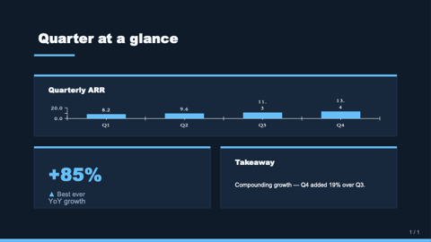

### hero-stat
One enormous headline number with a tagline. Use when the slide exists to
make ONE point land — single source of truth, like "47% of Americans...".

- `value` — `text`, ≤ 20 chars. Required. The big number ("$1.2M MRR", "47%").
- `label` — `text`, ≤ 60 chars. Required. One-sentence supporting line.
- `caption` — `text-block`, ≤ 240 chars. Optional. Smaller body context below the label.
- `eyebrow` — `text`, ≤ 32 chars. Optional. Small uppercase label above the number.

> **Guidance:** Use sparingly — at most one hero-stat per deck. The whole slide is one number, so make sure that number is the headline of the deck. Pair with a section-divider before, not a chart-with-takeaway.

### matrix-2x2
Quadrant matrix with optional axis labels. Each quadrant is a polymorphic
region — kpi/text/bullets/image/etc. Use for BCG-style frameworks
(priority×effort, urgency×importance, growth×profitability).

- `title` — `text`, ≤ 50 chars. Optional.
- `xLabel` — `text`, ≤ 32 chars. Optional. Axis label below the matrix.
- `yLabel` — `text`, ≤ 32 chars. Optional. Axis label rotated on the left.
- `topLeft`, `topRight`, `botLeft`, `botRight` — `region` cells (all required).

> **Guidance:** Quadrants only make sense when the two axes are genuinely orthogonal. If the four boxes are just "four good ideas", use stat-grid-3 or split-3-horizontal instead. Use bullets-shaped regions for option lists; kpi for headline numbers per quadrant.

### image-full-bleed
The image fills the entire slide; an optional `caption` renders in a thin dark band along the bottom edge. Use for cinematic shots, product photography, or place-setting visuals where the picture IS the slide.

- `image` — `image-ref`. Required.
- `caption` — `text`, ≤ 120 chars. Optional. Italic credit/location line.

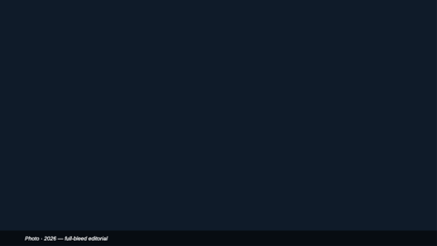

### image-with-caption
Editorial layout: image at 60% width with generous left margin, italic caption below, optional uppercase credit line further down. Magazine feel.

- `image` — `image-ref`. Required.
- `caption` — `text-block`, ≤ 320 chars. Required.
- `credit` — `text`, ≤ 80 chars. Optional. Renders in small uppercase muted text.

### image-pair
Two images side by side with optional brand-colored labels above each. Perfect for before/after, comparison studies, design A/B.

- `title` — `text`, ≤ 50 chars. Optional.
- `leftImage`, `rightImage` — `image-ref`. Both required.
- `leftLabel`, `rightLabel` — `text`, ≤ 32 chars. Optional. Rendered as small uppercase headings.

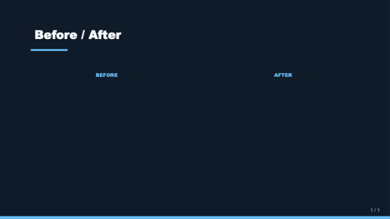

### image-split-text
Immersive 50/50: image is full-bleed on its half (no card backing — touches slide edges), text fills the other half with generous interior padding.

- `title` — `text`, ≤ 60 chars. Required.
- `text` — `text-block`, ≤ 480 chars. Required.
- `image` — `image-ref`. Required.
- `imageSide` — `text` (`left` or `right`). Optional, default `right`.

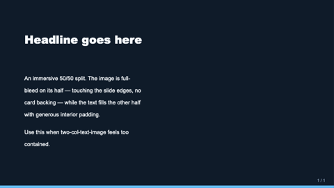

### pricing-table
2–4 pricing tier cards in a row. Each tier: `{ name, price, period?, features?, recommended? }`. Recommended tier renders with a brand fill + ribbon.

- `title` — `text`, ≤ 50 chars. Optional.
- `tiers` — `bullets`, 2–4 entries. Each entry is the tier object above.

### quote-with-portrait
Pull-quote with a circular portrait of the speaker on the left, italic quote on the right, name + role beneath. More humane than `quote` when the source matters.

- `quote` — `text-block`, ≤ 280 chars. Required.
- `name` — `text`, ≤ 60 chars. Required.
- `role` — `text`, ≤ 80 chars. Optional. Italic role/affiliation line.
- `portrait` — `image-ref`. Optional — placeholder circle when omitted.

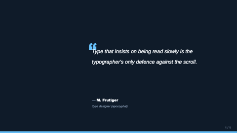

### key-point
One central tagline + 2–4 supporting points underneath, each with optional icon (from the 12-icon enum) + heading + 1-line description. Use for "3 reasons why", "core principles", learn-objectives slides.

- `headline` — `text`, ≤ 80 chars. Required.
- `points` — `bullets`, 2–4 entries. Each entry is `{ icon?, title, description? }`.

### freeform
Escape-hatch layout — pass a `shapes` array of typed primitives with positions in fractions of slide size. Use ONLY when no other layout fits (custom diagrams, bespoke compositions).

- `title` — `text`, ≤ 80 chars. Optional.
- `shapes` — `bullets`, 1–40 entries. Each entry is `{ kind, x, y, w, h, ... }` where `kind` is `text | rect | roundRect | ellipse | line | image`. Coordinates are 0..1 fractions; origin top-left.

> **Guidance:** This is a power tool — most decks should never reach for it. Try a region-based layout (split-N, dashboard, framed, matrix-2x2) first.

### framed
Five-region layout with optional edge bands — header, footer, leftEdge,
rightEdge, plus a required center. Use when one slide needs more
context than the global chrome can carry: persistent legends, side
glossaries, full-width headlines tied to a chart below.

- `title` — `text`, ≤ 50 chars. Optional. Small slide title above the header band.
- `header` — `region`. Optional. Top band, full slide width.
- `footer` — `region`. Optional. Bottom band, full slide width.
- `leftEdge` / `rightEdge` — `region`. Optional. Sidebar columns.
- `center` — `region`. Required. Main content area; expands to fill any unused edge space.

> **Guidance:** If you only need a header or only a footer, prefer the standard chrome (`page-header`, `page-footer`) and a focused layout. Reach for `framed` when two or more edges genuinely carry content. Avoid pairing it with thick global chrome — set `chrome: none` to give the edges room.

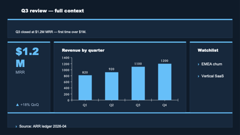

### team-grid
Photo grid of team members — circular avatars + name + role + optional bio.
2–8 members; 5+ members render as two rows.

- `title` — `text`, ≤ 50 chars. Optional.
- `members` — `bullets`, 2–8 entries. Each entry is `{ name, role?, image?, bio? }` where `image` is an `image-ref` (rendered with `shape: "circle"` automatically).

> **Guidance:** Bios are 1-line max. Don't over-pack — if you have 6 members and 3 sentences each, the slide collapses. Use `image_gen` only when you have actual headshot URLs; otherwise omit `image` and the layout draws a polite placeholder circle.

## Components

### header
Slide-top eyebrow + title block. Used internally by content layouts.

- `eyebrow` — `text`, ≤ 20 chars. Optional.
- `title` — `text`, ≤ 60 chars. Required.

### footer
Slide-bottom byline (date or context). Not used by chrome — see `page-number` for the master page-number stamp.

- `text` — `text`, ≤ 40 chars. Required.

### kpi-tile
A single KPI card. Slots: `value` (text ≤ 8), `label` (text ≤ 20),
`delta` (text ≤ 10, optional), `trend` (text `up`/`down`/`flat`, optional).

### takeaway-callout
Boxed conclusion at the bottom of a content slide.

- `text` — `markdown-inline`, ≤ 160 chars. Required.

## Tokens

This theme exposes these tokens. SlideML can reference them via theme defaults.

- `bg-canvas` — deep navy slide background.
- `bg-card` — slightly lighter card / surface fill.
- `brand-primary` — cyan, primary accents and KPI values.
- `brand-deep` — deeper blue, secondary accents and section dividers.
- `text-strong` — high-contrast body and title text.
- `text-muted` — labels, captions, page numbers.
- `accent` — warm orange, used sparingly for deltas / callouts.
- `divider` — hairline color for separators and outlines.
- `font-latin` — Latin: Inter → IBM Plex Sans → Helvetica Neue → Arial. Inter is the engineering-blog default; IBM Plex is the next-best fallback when Inter is unavailable.
- `font-cjk` — CJK: PingFang SC (macOS) → Source Han Sans CN (Linux) → Microsoft YaHei (Windows) → Noto Sans CJK SC (cross-platform). Order targets macOS first because the deck author is most likely viewing on macOS; Windows-installed Office picks YaHei.
- `font-mono` — JetBrains Mono → Fira Code → SF Mono → Menlo → Consolas. Code blocks expect a programming font with proper ligatures and 0/O distinction.

## Chrome

Decorations applied to every slide unless the slide opts out with `chrome: none`.

- `page-number` — bottom-right, muted; "n / N" format.
- `brand-bar` — 2pt cyan bar along the bottom edge.

## Examples

See `examples/` for short SlideML decks rendered in this theme.
